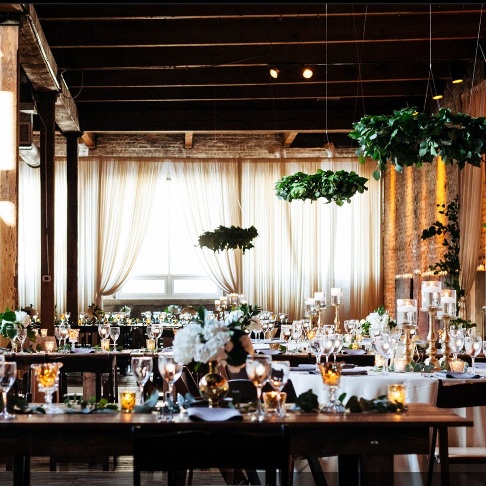

# Gestaltungsregeln

Kurzfassung für alle, die an dieser Website weiterarbeiten. Sie ist kein
Styleguide für die Marke, sondern die Begründung hinter dem Code — damit
spätere Änderungen nicht gegen bestehende Entscheidungen laufen.

---

## Grundhaltung

Die Seite soll nach Handwerk aussehen, nicht nach Baukasten. Konkret heißt das:

- **Ein Stylesheet, eine Wahrheit.** Alle Werte kommen aus den Tokens ganz
  oben in `assets/css/styles.css`. Keine Einzelfarben, keine Einzelabstände
  irgendwo im Markup.
- **Der Grund ist echtes Schwarz** (`--ink: #000000`). Nicht #08080A, nicht
  „fast schwarz". Auf einem OLED-Bildschirm schaltet #000 die Pixel ab: ein
  angeschnittenes Foto hat dann keinen Rand mehr, an dem es aufhört. Genau
  davon lebt der Auftritt.
- **Fotos tragen die Seite.** Wo ein Bild die Aussage trägt, braucht es keine
  Grafik, keinen Farbverlauf und keinen Leuchteffekt daneben. Bilder laufen
  im Zweifel bis an die Fensterkante, nicht bis zum Satzspiegel.
- **95 % schwarzweiß, 5 % Marke.** Lila (`--violet`, `--orchid`) markiert und
  trägt nicht: aktiver Menüpunkt, Hover auf einer Kontaktangabe, ein Punkt
  von vier Pixeln. Wer daraus eine Fläche macht, kippt den ganzen Auftritt
  ins Templatehafte.
- **Keine Karten.** Kein Rahmen, kein eigener Grund, keine runde Ecke um
  einen Inhalt herum. Getrennt wird durch Haarlinien und Abstand. `--r-m`
  steht deshalb auf 0.
- **Keine Pillen.** Eine Aktion ist ein Textlink mit einer Linie darunter,
  die beim Ansteuern durchläuft (`.btn`). Die einzige Ausnahme ist der
  Absendeknopf eines Formulars — er ist groß und hat Linien oben und unten,
  aber auch er hat keine Fläche im Ruhezustand.
- **Keine Dauerbewegung.** Nichts pulsiert, nichts wandert von allein.
- **Nicht alles auf die Mittelachse.** Überschriften stehen links, Text sitzt
  unten links im Bild, die sechs Bühnen wechseln die Seite.
  Zentrierter Satz stellt nichts in ein Verhältnis.
- **Keine Zeichen vor dem Text.** Kein Strich vor der Auszeichnungszeile, kein
  Punkt vor dem Merkmal, keine Nummer vor dem Menüpunkt, kein Gedankenstrich
  zwischen Nummer und Name. Was trennt, ist der Abstand. Ein Zeichen davor ist
  eine zweite Aussage über etwas, das für sich stehen kann — und in der Menge
  liest es als Zierrat.
- **Keine Silbentrennung.** `hyphens:auto` setzt am Zeilenende einen
  Trennstrich; in Display-Größe ist der so breit wie ein Gestaltungselement.
  `overflow-wrap:break-word` bleibt als Notnagel — es bricht ohne Strich und
  greift nur, wenn ein Wort wirklich nicht in die Zeile passt.
- **Kein Gedankenstrich im Satz.** Wo einer stand, steht jetzt ein Komma,
  ein Doppelpunkt oder nichts. Kein Wort wurde dafür geändert; das erledigt
  `tools/striche-ersetzen.py` und es ist mehrfach ausführbar. Stehen bleiben
  nur Bereichsangaben (`12–14`, `Mo–Fr`, `8–18 Uhr`), Bindestriche in
  Wörtern (`Gastro-Personal`, `Auf- und Abbau`) und die Trennung in `<title>`
  — die steht im Reiter des Browsers, nicht auf der Seite.
  **Auch `main.js` zählt.** Der Ersetzer lässt `<script>` in Ruhe, weil dort
  Programm steht und kein Satz. Drei Meldungen des Formulars stehen aber als
  Zeichenkette in `assets/js/main.js` — und die liest der Benutzer sehr wohl
  („Das ging schnell — bitte noch einmal auf Senden klicken"). Sie sind
  ersetzt; `striche-ersetzen.py` meldet solche Stellen jetzt am Ende jedes
  Laufs, umgeschrieben werden sie von Hand.
- **Unterstrichen heißt: hier geht es weiter.** Eine Linie unter einem
  kurzen Eintrag liest im Netz als Link. Wo nichts dahintersteckt, darf
  deshalb keine Linie stehen — die Aufzählungen der Leistungsseiten
  (`.einsaetze`, `.erwartungen`) trennen durch Abstand. Eine Linie über die
  **volle Breite** zwischen zwei Blöcken ist etwas anderes: das ist ein
  Trenner, kein Unterstrich, und der bleibt (Stellenliste, Abschnittskanten).

---

## Bewegung

Das gesamte Bewegungssystem steht am Ende von `styles.css` unter der
Überschrift `BEWEGUNG`. Es hängt an drei Zahlen, die `main.js` beim Scrollen
schreibt:

| Variable | Wo | Bedeutung |
|---|---|---|
| `--weg` | `[data-weg]` | 0 → 1, wie weit der Abschnitt oben hinausgelaufen ist |
| `--lauf` | `[data-lauf]` | 0 → 1, wie weit das Element durchs Fenster gewandert ist |
| `--kapitel` | `.stage` | 0 → 1, Fortschritt innerhalb einer Bühne |

Was daraus wird, entscheidet allein das Stylesheet. Ein neuer Effekt braucht
deshalb in der Regel **keine** Zeile JavaScript — nur ein `data-`Attribut im
Markup und eine Regel im CSS.

**Regeln, die dabei gelten:**

1. **Bewegung wird vom Scrollen geführt, nicht von der Zeit.** Zeitgesteuerte
   Animationen gibt es nur beim Seitenaufruf (Hero, Kopfbild, Preloader).
2. **Eine Geste pro Element.** Überschriften werden aufgedeckt *oder* fahren
   ein — nicht beides. Zwei gleichzeitige Bewegungen auf derselben Zeile lesen
   als Effekt, eine liest als Schnitt.
3. **Animiert werden nur `transform` und `opacity`** (plus `clip-path` und
   `mask-size` bei den Aufblenden). Keine Layout-Eigenschaften.
4. **`prefers-reduced-motion` schaltet alles ab.** `main.js` meldet dann gar
   keine Spuren an; die Vorgabewerte in `var(--weg, 0)` ergeben genau die
   ruhige Fassung. Zusätzlich gibt es einen `@media`-Block, der Masken und
   Beschnitte auflöst.
5. **Ohne JavaScript ist alles sichtbar.** `.kein-js` hebt jede Startmaske auf.

### Die teuerste Falle: `will-change` auf Vorrat

`will-change:transform` sagt dem Browser: *lege dieses Element als eigene
Ebene an und halte sie bereit.* Für die eine Fläche, die sich gerade bewegt,
ist das richtig — und es ist messbar richtig: ohne `will-change` steigt die
Rasterarbeit einer Durchfahrt durch `dienstleistungen.html` von 907 auf
2296 ms.

Für **alle sechs Bühnen gleichzeitig** ist es dagegen das Gegenteil. Jede
Bühne hält zwei bildschirmfüllende Fotos übereinander; auf einem 1440er
Bildschirm mit doppelter Pixeldichte ist eine solche Ebene rund 20 MB groß.
Zwölf davon sind über 200 MB, die dauerhaft im Grafikspeicher liegen sollen.
Der Compositor wirft dann Kacheln weg und legt sie beim Zurückscrollen neu
an — und genau das sieht man als Ruckeln.

Deshalb steht vor **jedem** `will-change` einer Bühne oder Szene die Klasse
`.live`, die `main.js` beim Scrollen setzt:

```css
.scene{ transform:scale(var(--zoom,1)); }        /* keine Ebene */
.stage.live .scene{ will-change:transform; }     /* Ebene nur, solange sichtbar */
```

Wer eine neue Fahrt baut, macht es genauso. Und wer im `@media`-Block für
das Telefon etwas davon zurücknehmen will, muss die Spezifität mitnehmen:
`.scene{…}` allein verliert gegen `.stage.live .scene{…}`.

Gemessen wird das nicht an der Bildrate — die schwankt zu stark —, sondern
an der Arbeit. `scratchpad/arbeit.js` summiert über eine Durchfahrt die
Zeiten aus dem Tracing (Stil, Layout, Malen, Rastern). Der Unterschied
zwischen zwei Fassungen ist dort stabil ablesbar, die Bildabstände sind es
nicht.

### Erst messen, dann schreiben

Der Scroll-Motor las früher pro Schleife die Rechtecke, schrieb seine Werte,
und die nächste Schleife las wieder. Jedes Schreiben macht das Layout
ungültig, jedes folgende Lesen erzwingt es neu. `messen()` sammelt deshalb
alle Rechtecke in einem Zug, erst danach schreiben `updateStages()`,
`updateMotion()` und `updateKino()`. Wer eine vierte Schleife dazunimmt,
hängt ihre Messung mit in `messen()` — nicht in die eigene Schleife.

### Der Vorspann: auftauchen, polieren, schneiden

Beim ersten Öffnen läuft ein Einstieg in drei Schritten, alles in
Schwarzweiss und alles in CSS — kein Video, keine Bibliothek:

| ab | was | wie |
|---|---|---|
| 0,10 s | eine Lichtbahn zieht quer durch das dunkle Bild | `#preloader::before`, `preLicht` |
| 0,30 s | das Wortzeichen taucht auf: Unschärfe → Schärfe, bis auf **66 %** Helligkeit | `.pre-logo__img`, `preAuftauchen` |
| 1,85 s | ein Glanz läuft **durch die Buchstaben** | `.pre-glanz`, `preGlanz` |
| 2,10 s | das Zeichen geht auf volles Weiss | `preVoll` |
| 2,75 s | **Schnitt** auf die Startseite | `main.js` |

**Warum das Zeichen zwischendurch nur bei 66 % steht.** Das Wortzeichen ist
selbst weiss. Ein weisser Glanz auf Weiss ist nichts — der erste Versuch sah
aus, als wäre der Glanz gar nicht da. Er wird erst sichtbar, wenn das Zeichen
dunkler ist als er: dann ist er die hellste Stelle im Bild, und hinter ihm
bleibt volles Weiss zurück. Das liest man als „das Zeichen wird poliert",
nicht als „da wandert ein Balken".

**Der Glanz liegt in einer Maske, nicht über einem Kasten.** `.pre-glanz`
trägt das Logo als `mask` über einem hellen Verlauf; sichtbar wird der
Verlauf nur dort, wo das Zeichen deckt. Ein Balken über dem Bildkasten wäre
das offensichtliche, aber deutlich billigere Bild.

**Der Abgang ist ein Schnitt, kein Übergang.** Die 0,16 s in `#preloader.done`
sind kein Ausblenden, sondern nehmen nur das Flackern eines harten
Einzelbild-Wechsels weg; unterhalb von etwa 0,2 s liest das Auge einen
Schnitt. Vorher fuhr das Zeichen der Kamera entgegen und überblendete in den
Hero — das ist auf Wunsch dem direkten Sprung gewichen.

**Danach steht die Seite einfach da: `.sofort`.** Liefe nach dem Schnitt noch
die Einfahrt des Heros, wären es zwei Vorspänne hintereinander — erst das
Zeichen, dann eine Seite, die sich auch noch aufbaut. `main.js` setzt deshalb
`sofort` auf `<html>`, und der Block dazu in `styles.css` schaltet die
Einfahrt ab.

Die Einfahrt bleibt aber im Markup, denn sie wird noch gebraucht:

| Klasse | wann | was |
|---|---|---|
| `sofort` | erster Aufruf, keine reduzierte Bewegung — also: es kommt ein Vorspann | Hero steht von der ersten Zeichnung an fertig da |
| `los` | zweiter Aufruf oder reduzierte Bewegung — also: es kommt keiner | alle Einfahrten starten |

Beide werden im selben Moment gesetzt, im Kopf der Seite, und schließen
einander aus. Eine dritte Klasse `vorspann` gab es einmal; sie ließ den
Hero warten, bis der Vorspann abging — genau die Wartezeit, die den LCP auf
2996 ms hob.

Beim **zweiten Aufruf im selben Besuch** gibt es keinen Vorspann
(`sessionStorage`) — dort ist die Einfahrt der Einstieg, und `sofort` wird
nicht gesetzt. Dasselbe bei reduzierter Bewegung.

Die Entscheidung `vorspann`/`los` fällt im **Inline-Skript im Kopf** von
`index.html`, nicht in `main.js`. Stünde sie am Seitenende, liefe die
Einfahrt schon, bevor die Klasse gesetzt ist — und man sähe ein Aufblitzen.

Wer eine weitere Einfahrt dazunimmt, hängt sie an `.los`, trägt sie in den
`.kein-js`-Block ein und prüft, ob sie auch in den `.sofort`-Block gehört.

**`sofort` wird beim ersten Aufruf sofort gesetzt, nicht erst beim Abgang
des Vorspanns — und daran hing die Ladezeit.** Zuerst bekam der Hero seine
Einfahrt, und `sofort` kam erst, wenn der Vorspann fertig war. Der Hero
stand damit die ganzen 2,75 Sekunden auf `opacity:0`, und das größte
sichtbare Element der Seite galt dem Browser erst danach als gezeichnet:
**LCP 2996 ms.** Da der Vorspann ohnehin deckend darüber liegt, sieht
niemand, ob der Hero darunter einfährt oder schon steht. Also steht er von
der ersten Zeichnung an fertig da — **LCP 356 ms**, bei unverändertem Bild.

Die Lehre ist allgemeiner als der Fall: **eine Einfahrt unter einer
deckenden Fläche ist keine Gestaltung, sondern nur eine späte Messung.**

**Wer an den Zeiten dreht, muss zwei Stellen anfassen:** die Animationen in
`styles.css` und die beiden `setTimeout` in `main.js`. Der Schnitt muss nach
dem letzten Bild der letzten Animation kommen — ein Vorspann, der mitten in
seiner eigenen Bewegung abgeschnitten wird, liest als Fehler und nicht als
Tempo.

### Die Falle: Tests, die blind warten

Der Vorspann ist zweimal länger geworden, und zweimal fielen dadurch Tests
um, die eine feste Zahl abwarteten: einmal meldete `treffer.js` jede
Trefferfläche als zu klein, einmal `verdeckt.js` die Startseite als verdeckt.
Beide Male war die Website in Ordnung — gemessen wurde die schwarze Fläche
des Vorspanns.

Wer auf den **Inhalt** einer Seite schaut, wartet deshalb nicht auf eine
Zahl, sondern auf den Zustand (`scratchpad/_warten.js`):

```js
await p.waitForFunction(() => {
  const v = document.getElementById('preloader');
  if(!v) return true;
  const cs = getComputedStyle(v);
  return cs.display === 'none' || cs.visibility === 'hidden';
});
```

### Die Falle: ein Vorspann, der sich nicht wegnehmen lässt

`#preloader` ist eine deckende schwarze Fläche über der ganzen Seite. Sie
verschwindet, wenn `main.js` ihr `.done` gibt. Ohne JavaScript passiert das
nie — dann steht das Wortzeichen auf Schwarz und **die Website ist nicht
erreichbar**. Genau das war monatelang der Fall.

```css
.kein-js #preloader{ display:none; }
```

Der bisherige Test hat es nicht gefunden, weil er unsichtbare Elemente zählt:
Was *darunter* liegt, hat weiterhin `opacity:1`. Deshalb gibt es jetzt
`scratchpad/verdeckt.js` — er fragt mit `elementFromPoint`, was an der Stelle
der Überschrift wirklich ganz oben liegt, und zwar in allen drei Lagen
(normal, ohne JavaScript, reduzierte Bewegung).

Die Regel dahinter gilt für jede Überlagerung: **Was eine Seite verdeckt, muss
sich ohne die Technik wegnehmen lassen, die es aufgebaut hat.**

### Die Falle: `position:sticky` braucht einen Weg

Die linke Spalte des Intros bleibt beim Scrollen stehen, während rechts Text
und Foto weiterlaufen. Beim ersten Versuch tat sie nichts — `position:sticky`
stand da, wirkte aber nicht.

Der Grund ist keine fehlende Eigenschaft, sondern fehlender Platz: die linke
Spalte war mit 615 px **höher** als die rechte mit 524 px. Die Rasterzeile ist
so hoch wie ihre höchste Zelle; das klebende Element füllte sie damit ganz aus
und hatte keinen Weg, den es zurücklegen konnte.

Zwei Bedingungen müssen deshalb zusammenkommen:

1. `align-items:start` am Raster — bei `stretch` ist jede Zelle so hoch wie
   die Zeile, und ein Kind, das die ganze Höhe füllt, kann nirgends kleben.
2. Die klebende Spalte muss **kürzer** sein als die andere. Dafür ist das Foto
   aus der linken in die rechte Spalte gewandert.

Nachmessen lässt sich das in einer Zeile: klebt es wirklich, bleibt `top`
konstant, während die andere Spalte weiterwandert.

### Wort für Wort

`[data-worte]` zerlegt `main.js` in `<span class="wort">`; jedes Wort bekommt
seinen Index als `--n`, die Zeile ihre Anzahl als `--anz`. Daraus rechnet das
Stylesheet einen eigenen Fortschritt je Wort aus `--lauf`.

- **Kein `overflow:hidden` um ein Wort.** Eine Maske schneidet genau die
  Umlautpunkte und Unterlängen ab, die in „TRÄGT." schon einmal gefehlt
  haben. Das Wort hebt sich stattdessen aus der Tiefe: von unten, aus der
  Unschärfe in die Schärfe.
- **Die Leerzeichen bleiben echte Textknoten.** Ohne sie liest ein
  Vorlesewerkzeug die Zeile ohne Pausen, und markierter Text lässt sich nicht
  mehr sinnvoll kopieren.
- **Der Vorgabewert von `--lauf` ist 1, nicht 0.** Ohne Motor (reduzierte
  Bewegung, kein JavaScript) steht die Zeile damit vollständig da.
- Die Unschärfe kostet gemessen 137 ms je Durchfahrt, rund 14 % der ganzen
  Arbeit. Sie steht deshalb nur am Schreibtisch und nur an zwei Zeilen.
  `filter` ist die teuerste der drei Eigenschaften; an einer Seite voller
  Absätze wäre sie nicht zu bezahlen.

### Warum hier kein GSAP und kein Lenis steht

Der Auftrag nannte GSAP, ScrollTrigger und Lenis — mit dem Zusatz „falls mit
dem bestehenden Tech-Stack kompatibel" und „vermeide unnötig schwere
Libraries". Beides zusammen ergibt hier ein Nein:

- Der Motor, der dafür da wäre, existiert bereits: eine `requestAnimationFrame`-
  Schleife, die drei Zahlen schreibt, und ein Stylesheet, das daraus die
  Bewegung macht. GSAP würde ihn nicht ergänzen, sondern ersetzen — und mit
  ihm die gesamte gemessene Arbeit von vorn beginnen lassen.
- Die Seite lädt **nichts** von fremden Servern. Keine Schriften, keine
  Skripte, kein Tracking. Deshalb braucht sie kein Cookie-Banner. Ein CDN-
  Skript wäre die erste Ausnahme, und sie stünde in der
  Datenschutzerklärung.
- Lenis ersetzt das Scrollen des Browsers durch eigenes. Auf einer Seite, die
  zweimal wegen Ruckelns beanstandet wurde, ist das genau das falsche Werkzeug:
  es macht jede Bildwiederholung von JavaScript abhängig, statt von der
  Bildlaufsteuerung des Systems.

Gemessen liegt die Seite bei 60 Bildern je Sekunde im Median. Was die
Bibliotheken leisten würden, leistet der vorhandene Motor bereits.

### Die eine Falle, die man kennen muss

> **Niemals `clip-path` auf ein Element legen, das der IntersectionObserver
> beobachtet.**

Ein beschnittenes Element hat eine leere Schnittfläche. Der Beobachter meldet
sich nie, das Element bekommt nie `.in` — und bleibt dauerhaft unsichtbar.
Das ist genau einmal passiert und hat sieben Überschriften der Startseite
verschwinden lassen.

Deshalb:

- **Bilder:** Beschnitt liegt auf dem `<picture>` im Inneren, nie auf der
  beobachteten Figur (`.wide-shot`, `.gal__item`).
- **Überschriften:** dort wird mit `mask-size` gearbeitet, nicht mit
  `clip-path`. Eine Maske beschneidet nur die Darstellung, nicht die
  Schnittfläche.

Wer eine neue Aufblende baut, prüft mit einem Blick in die Konsole:

```js
[...document.querySelectorAll('.reveal-up')].filter(e => !e.classList.contains('in'))
```

Nach einmal Durchscrollen muss diese Liste leer sein.

### Die Kehrseite: eine Maske ist so groß wie ihr Kasten

Die Maske löst die Beobachter-Falle — dafür hat sie eine eigene. Sie deckt
genau den **Rahmenkasten** ab, und der ist bei einem Durchschuss unter etwa
1,25 kleiner als die Schrift darin. Alles, was oben oder unten heraussteht,
fällt weg: Umlautpunkte und Unterlängen. Auf Deutsch heißt das, dass
ausgerechnet Ä, Ö und Ü ihre Punkte verlieren — im Hero fehlten sie bei
„TRÄGT.", in einer Zwischenüberschrift bei „SO LÄUFT".

**Was nicht hilft:** die Maske über den Kasten hinausschieben.
`mask-position` und `mask-size` wirken zwar, aber `mask-clip` begrenzt die
bemalte Fläche weiter auf den Rahmenkasten. Der dafür vorgesehene Wert
`no-clip` wird von Chromium als gültig gemeldet und ändert nichts —
nachgemessen mit drei Varianten (mit, ohne, und mit `padding`).

**Was hilft, ist nur ein größerer Kasten.** Je nachdem, womit beschnitten
wird:

- **Maske** (`h1/h2/h3.reveal-up`): `padding-block:.14em`. Bewusst ohne
  Ausgleich durch einen negativen Außenabstand — diese Regel steht weit
  unten im Stylesheet und würde bei gleicher Spezifität die
  Abstandsangaben der einzelnen Abschnitte überschreiben.
- **`overflow:hidden`** (die Zeilen im Hero, auf den Unterseiten und im
  Fuß): dort bekommt die maskierte Zeile einen Durchschuss, in den die
  Schrift wirklich hineinpasst (`--zeile-weit:1.26`), und die optische Enge
  kommt über einen negativen Abstand **zwischen** den Zeilen zurück
  (`--zeile-eng:.96`). Die Maske schneidet dann nur noch Luft.

Nachmessen lässt sich das nur im Bild, nicht im DOM: dieselbe Stelle einmal
mit und einmal ohne Maske aufnehmen und die beiden Aufnahmen vergleichen.
Wichtig dabei, sonst misst man Unsinn:

- Erst **nach** der Aufblende die Maske abschalten, sonst vergleicht man
  einen fertigen mit einem nie gestarteten Zustand.
- **Nur das geprüfte Element** entmasken. Ein globales `overflow:visible`
  nimmt auch `body{overflow-x:hidden}` weg; dann erscheint ein Rollbalken,
  die Zeile bricht anders um, und man vergleicht zwei Layouts.
- Bei `overflow` statt Maske gibt es keinen layoutneutralen Weg — dort hilft
  nur Hinsehen.

### Die zweite Falle: `aspect-ratio` und das `height`-Attribut

Jedes `` trägt `width`/`height` im Markup — richtig so, das verhindert
Springen beim Laden. Der Browser setzt diese Attribute aber als
Präsentationshinweis in echte `width`/`height`-Werte um, und **ein gesetzter
Wert schlägt `aspect-ratio`.**

Wer im Stylesheet ein Seitenverhältnis vorgibt, muss deshalb `height:auto`
dazuschreiben:

```css
.wide-shot img{ width:100%; height:auto; aspect-ratio:16/9; object-fit:cover; }
```

Ohne die eine Zeile stand das Bildband auf allen sechs Leistungsseiten in
Originalhöhe da — also genau als der bildschirmhohe Block, den die Regel
verhindern sollte. Aufgefallen ist es erst beim Nachmessen im Browser, weil
die Regel im Stylesheet völlig richtig aussah.

Prüfen lässt sich das in einer Zeile:

```js
[...document.images].filter(i => {
  const cs = getComputedStyle(i);
  if (cs.aspectRatio === 'auto') return false;
  const [a, b] = cs.aspectRatio.split('/').map(Number);
  const r = i.getBoundingClientRect();
  return Math.abs(r.width / r.height - a / b) > 0.02;
})
```

### Was wo passiert

| Ort | Bewegung |
|---|---|
| Hero, Kopf der Unterseiten | Bild läuft langsamer mit als der Text (`--weg`) |
| Hero, Titelzeilen | Jede Zeile fährt aus ihrer eigenen Maske nach oben (`.line`) |
| Balken unter der Kopfzeile | fährt heraus, die sechs Einträge kommen versetzt nach (`.megabar`) |
| Sechs Bühnen (`dienstleistungen.html`) | Kamerafahrt aus `--zoom`, `--detail`, `--panel`, `--door` |
| Bühnen, Rand | Kinobalken und Lichtabfall (`.kino`, über `--kino`) |
| Bühnen, oben links | Kapitelmarke mit Fortschrittslinie (`--kapitel`) |
| Bühnen, rechts | Kapitelrail als Sprungnavigation, baut `main.js` |
| Bühnenende | Abblende auf dem letzten Zehntel |
| Überschriften | Aufblende von oben nach unten (`mask-size`) |
| Bildbänder, Galerie | Aufdecken von unten plus Gegenbewegung des Motivs |
| Fußzeile | Schlusszeile fährt zeilenweise auf (`.foot__claim`, gleiche Technik wie der Hero) |
| Einsatzleitung (Sicherheit) | Aufdecken von unten, Beschriftung im selben Rahmen unter dem Foto |
| Zeiger (nur Maus) | Ring läuft nach, wird über Links größer, zeigt über Bildern „Ansehen" |
| Abschnittskanten | Einsatzlinie: ein violetter Punkt wandert mit `--lauf` nach rechts |
| Leistungsseiten, unter dem Kopfbild | Einsatzband: die Linie zieht sich auf, die Punkte kommen versetzt nach |

Die Kinobalken überbrücken die feste Navigationsleiste — ihre Höhe misst
`main.js` und legt sie als `--nav-h` ab. Wer an der Navigation etwas ändert,
muss dort nichts nachziehen.

### Der Zeiger ersetzt den Systemzeiger nicht

Der Ring (`.zeiger`) begleitet die Maus, er tritt nicht an ihre Stelle. Viele
Auftritte dieser Machart blenden den Systemzeiger aus — das nimmt allen die
Einstellung weg, die ihn vergrößert, invertiert oder auf hohen Kontrast
gestellt haben. Auf einer Seite, deren Ziel eine Anfrage ist, ist das ein
schlechtes Geschäft. Er wird außerdem nur angelegt, wenn
`(hover:hover) and (pointer:fine)` zutrifft und keine reduzierte Bewegung
gewünscht ist.

### Die dritte Falle: `animation:none` holt keinen Startwert zurück

Der `prefers-reduced-motion`-Block setzt `*{ animation:none !important }`.
Was seine Sichtbarkeit einer Einblendung verdankt — `opacity:0` plus
`animation:fadeIn … forwards` —, bleibt dadurch **unsichtbar**: die Animation
ist weg, der Startwert bleibt.

Das ist genau einmal passiert und hat den Vorspann im Hero verschwinden
lassen. Jede solche Stelle muss im Block einzeln zurückgeholt werden:

```css
@media (prefers-reduced-motion:reduce){
  .hero__sub, .hero__actions, .scrollcue > *, .pre-logo__img{ opacity:1; transform:none; }
}
```

Dasselbe gilt für scroll-geführte Werte: ohne Motor bleibt `--lauf` auf 0
stehen, und `scale(calc(1.12 - var(--lauf,0) * .12))` ergibt dann dauerhaft
1,12 — den Anfangszustand einer Fahrt, die gar nicht stattfindet. Auch das
wird im selben Block auf `transform:none` gesetzt.

Nachprüfen lässt sich beides mit einem zweiten Kontext im Browser
(`reducedMotion: 'reduce'`) und der Frage, ob irgendein Textelement auf
`opacity < 0.05` steht.

### Die vierte Falle: `animation … forwards` schlägt jede normale Regel

Der Scrollhinweis im Hero sollte beim Laden einblenden *und* beim Scrollen
wieder verschwinden — beides über `opacity`. Das geht nicht: eine Animation
mit `forwards` hält ihren Endwert fest und gewinnt gegen jede gewöhnliche
Deklaration. Der Hinweis blieb stehen.

Die Lösung ist banal, muss einem aber einfallen: **die beiden Bewegungen auf
zwei Elemente legen.** Die Einblendung liegt auf den Kindern
(`.scrollcue > *`), die Ausblendung beim Scrollen auf der Hülle
(`.hero[data-weg] .scrollcue`).

---

## Das Zeichen: Punkt und Linie

Die Website hat ein eigenes Zeichen, und es besteht aus genau zwei Formen:
**ein Punkt ist eine Position, eine Linie ist die Verbindung dazwischen.**
Das ist das Geschäft dieses Betriebs, auf das Knappste gebracht: Menschen
stehen an Stellen, und jemand hält sie zusammen.

Es tritt in zwei Zuständen auf, und beide benutzen dieselben Maße: eine
Haarlinie, Punkte von vier bis fünf Pixeln, genau ein Violett.

| | wo | was es zeigt |
|---|---|---|
| **Einsatzlinie** (`[data-spur]`) | Kante über größeren Abschnitten | eine Position, die sich bewegt |
| **Einsatzband** (`.einsatzband`) | einmal je Leistungsseite, zwischen Kopfbild und Text | eine Aufstellung, die steht |

### Die Einsatzlinie

Auf der Kante eines Abschnitts läuft ein kurzes helles Stück mit einem
violetten Punkt an der Spitze von links nach rechts. Wie weit, sagt
`--lauf` — es ist also scrollgeführt und steht still, wenn das Scrollen
still steht.

Vier Regeln, damit es Zeichen bleibt und nicht Effekt wird:

1. **Es kommt nichts hinzu.** Die Linie war schon da. Sie bekommt nur eine
   Richtung. Kein zweites Element, kein Kasten, kein Muster.
2. **Bewegt wird nur `transform`.** Der Punkt fährt auf einer eigenen Ebene,
   und die Ebene gibt es nur, solange der Abschnitt `.live` trägt.
3. **Violett nur als Punkt.** Vier Pixel, mehr nicht.
4. **Bei reduzierter Bewegung gar nicht.** Ohne Motor bliebe `--lauf` auf 0,
   der Punkt stünde dauerhaft links am Rand und sähe aus wie ein Fehler.

Angemeldet wird sie in `main.js`, und zwar nur an Abschnitten, die
**ohnehin schon eine Oberkante haben** (`borderTopWidth ≥ 0.5`). Wer eine
Linie zeichnet, wo vorher keine war, hat das erste Prinzip gebrochen.

### Das Einsatzband

Die sechs Leistungsseiten teilen einen Bauplan: dieselben Überschriften,
dieselbe Reihenfolge, dieselben Bausteine. Das ist richtig — sechs
Geschwisterseiten sollen ein System sein. Falsch war nur, dass sie sich
**vollständig** glichen und dadurch austauschbar wirkten.

Das Band ist die Antwort darauf. Es sitzt an der Kante zwischen Kopfbild
und Text — also dort, wo ohnehin ein Trenner hingehört — und trägt je Seite
eine andere Figur:

| Seite | Figur | Bild dahinter |
|---|---|---|
| Gastro-Personal | `reihe` | Servicelinie am Pass |
| Sicherheit | `posten` | über ein Gelände verteilt |
| Promotion & Hostess | `paare` | paarweise am Stand |
| Logistik | `kette` | verdichtet sich zum Tor hin |
| Fahrservice | `fahrt` | zwei Punkte, eine Fahrt dazwischen |
| Reinigung | `bahn` | Bahn für Bahn über die Fläche |

Drei Regeln:

- **Es zählt nichts.** Fünf Punkte heißen nicht fünf Leute. Eine Zahl wäre
  eine Behauptung über den Betrieb, und die darf hier nicht erfunden werden
  (siehe „Erfinde keine Informationen über das Unternehmen"). Die Figur
  zeigt eine Form. Wer sie als Zahl liest, hat zu viele Punkte gesetzt —
  **mehr als sechs gehören nicht hinein.**
- **Violett steht dort, wo die Leitung steht.** Ein Punkt je Seite, nie
  zwei.
- **Die Positionen stehen im Stylesheet, nicht im Markup.** Das Markup
  trägt nur den Namen der Figur und die Zahl der Punkte
  (`data-figur="posten"`); wo sie sitzen, sagt `:nth-child()`. Sonst
  stünden Einzelmaße im Markup, und das ist genau das, was „Ein Stylesheet,
  eine Wahrheit" verbietet.

Aufgedeckt wird über das vorhandene `data-stagger`: der Beobachter setzt
`.in` und gibt jedem Kind sein `--i`. **Keine Zeile JavaScript kommt dafür
hinzu.**

**Die Falle dabei:** `.kein-js [data-stagger] > *{ transform:none !important }`
trifft auch die Punkte des Bandes — und schöbe jeden um seinen halben
Durchmesser nach rechts. Die Linie selbst ist ein Pseudoelement und wird von
`> *` gar nicht erst erreicht, stünde also ohne Skript dauerhaft auf Breite
null. Beides braucht im `.kein-js`-Block eine eigene Zeile.

---

## Der Seitenrand

Alles, was den Seitenrand hält, trägt `.wrap`. Die Klasse setzt genau zwei
Dinge: eine Höchstbreite und `padding-inline:clamp(20px,5vw,64px)`. Dass jeder
Block auf jeder Seite denselben Abstand zur Kante hat, hängt allein daran.

### Die Falle: die Kurzschreibweise `padding` löscht `.wrap`

Ein Element trägt oft beide Klassen gleichzeitig — `class="wrap trust__grid"`.
Schreibt die zweite Regel dann

```css
.trust__grid{ padding:clamp(24px,3.2vw,40px) 0; }   /* falsch */
```

setzt die Kurzschreibweise **alle vier** Kanten, also auch links und rechts —
und macht damit den Seitenrand zunichte, den `.wrap` gerade gesetzt hat. Der
Block klebt an beiden Kanten, während der Rest der Seite Luft hat. Richtig ist:

```css
.trust__grid{ padding-block:clamp(24px,3.2vw,40px); }   /* richtig */
```

Genau das ist zweimal passiert: bei der Vertrauensleiste der Startseite und
bei der Blätternavigation am Fuß der sechs Leistungsseiten. Aufgefallen ist es
erst an einem Handy-Bildschirmfoto — auf breiten Fenstern sieht ein fehlender
Rand nach Absicht aus.

Nachmessen lässt sich das über alle Seiten in einer Schleife:

```js
const soll = Math.min(Math.max(20, innerWidth * 0.05), 64);
[...document.querySelectorAll('.wrap')].filter(e => {
  const cs = getComputedStyle(e);
  return Math.abs(parseFloat(cs.paddingLeft)  - soll) > 1
      || Math.abs(parseFloat(cs.paddingRight) - soll) > 1;
});
```

Nach dem Laden muss diese Liste auf jeder Seite und in jeder Fensterbreite
leer sein.

### Die zweite Falle: `footer` ist nicht nur der Seitenfuß

`<footer>` ist ein ganz gewöhnliches Element und darf überall stehen. Auf der
Startseite steht eines davon **im `<blockquote>`** des großen Zitats — dort
gehört die Quellenangabe hin. Eine Regel

```css
footer{ border-top:1px solid var(--line); padding:110px 0 48px; }   /* falsch */
```

traf deshalb auch sie: unter dem Zitat von Tim Mälzer stand eine Trennlinie
und 110 px Luft, bevor sein Name kam. Richtig ist `body > footer`. Dasselbe
gilt für `footer h2`, `footer ul` und `footer .brand__logo`.

Das ist der allgemeinere Punkt hinter beiden Fallen dieses Abschnitts: ein
Selektor, der nur einen Ort meint, muss auch nur diesen Ort treffen.

---

## Seitenaufbau

Die Website ist bewusst **mehrseitig**, auch wenn die Startseite lang ist:

```
Start
├── Dienstleistungen (Übersicht)
│   ├── Gastro-Personal
│   ├── Sicherheit
│   ├── Promotion & Hostess
│   ├── Logistik
│   ├── Fahrservice
│   └── Reinigung
├── Referenzen · Team · Galerie · Jobs · Kontakt
└── Impressum · Datenschutz
```

Jeder Punkt der Hauptnavigation führt auf eine **Seite**, nicht auf einen
Abschnitt der Startseite. Das ist der Unterschied zwischen einer
mehrseitigen Website und einer One-Page — und er entsteht in der
Navigation, nicht im Aussehen.

Der Brotkrumenpfad hat dadurch drei Ebenen: `Home / Dienstleistungen /
Sicherheit`.

### Wo welche Tiefe hingehört

Die sechs Bühnen mit der Kamerafahrt standen zuerst auf der Startseite und
machten dort allein knapp 12.500 der 21.000 Pixel aus — sechzig Prozent.
Genau daran las das Team die Seite als One-Page, und zu Recht: eine
Startseite, die den ganzen Betrieb in einem Zug erzählt, *ist* eine.

Deshalb liegen die Ebenen jetzt so:

| Seite | Aufgabe | Länge |
|---|---|---|
| Startseite | Hero, Einstiegstext, Film, Ablauf, Referenzen, Anspruch, Anfrage | rund 10 Bildschirmhöhen |
| Dienstleistungen | die sechs Bühnen als Kamerafahrt, jede führt weiter | rund 15 |
| Sechs Detailseiten | alles im Einzelnen | je 7 bis 8 |

**Die Bühnen gehören nicht zurück auf die Startseite.** Sie sind dort nicht
zu lang gewesen, sondern am falschen Ort: eine Startseite ordnet und
verweist, die Tiefe steht dahinter.

### Die Bereiche stehen im Menü, nicht auf der Startseite

Zwischenzeitlich standen die sechs Bereiche als **Szenen** (`.svc`) auf der
Startseite: sechs randlose Flächen von je rund 76 svh, zusammen etwa 4700
Pixel. Das war die Zwischenstufe zwischen dem alten Kachelraster und dem, was
jetzt da steht — und es war immer noch ein Drittel der Startseite für etwas,
das nur verweist.

Seitdem hängen sie am Menüpunkt **Dienstleistungen**: ein Klick, und ein
Balken fährt unter der Kopfzeile heraus, in dem alle sechs mit Foto, Nummer
und Namen stehen, dazu ein Weg auf die Übersicht (siehe „Der Balken unter der
Kopfzeile"). Die Startseite zeigt jetzt, was nur sie zeigen kann: den
Einstieg, den Film und die Referenzen.

Was dabei **nicht** passiert ist: die sechs Adressen sind unverändert, sie
stehen weiter im Fuß jeder Seite, und `dienstleistungen.html` mit den sechs
Bühnen ist unangetastet. Es ist ein Weg weniger auf der Startseite, kein
Inhalt weniger auf der Website.

**Die Szenen gehören nicht zurück.** Wer sie wiederhaben will, hat einen
Grund zu nennen, der über „da war mehr los" hinausgeht: die Startseite hatte
mit ihnen vierzehn Bildschirmhöhen und ohne sie zehn, und der Weg zu den
Bereichen ist mit dem Balken kürzer als mit vier Bildschirmen Scrollen.

**Achtung bei Adressen:** `dienstleistungen.html` liegt neben dem Ordner
`dienstleistungen/`. Die Adresse `/dienstleistungen` ohne Endung ist
deshalb auf jedem Host eine Sonderregel — sie steht in `vercel.json`,
`netlify.toml` und `.htaccess` jeweils **vor** der Regel für die
Unterseiten.

---

## Typografie

- Auszeichnung: Bricolage Grotesque · Fließtext: Instrument Sans ·
  Technisches: Space Mono. Alle drei liegen lokal unter `assets/fonts/`.
- **Fünf Stufen, sonst nichts:** `--fs-mega` (Hero, Schluss,
  Fußzeile), `--fs-display` (Titel der Unterseiten), `--fs-h2`, `--fs-h3`,
  `--fs-h4`. Wer eine sechste clamp-Formel schreibt, hat eine Stufe zu viel.
- **`--fs-mega` ist keine Schriftgröße, sondern eine Fläche.** Eine Zeile
  über die halbe Fensterbreite wird nicht gelesen, sie wird gesehen. Sie
  steht deshalb nur dort, wo eine Aussage den ganzen Bildschirm tragen darf,
  und immer mit `line-height` um 0,9 — die Zeilen müssen einander berühren.
- **Versalien nur da, wo sie etwas leisten** (`.u-caps`, Eyebrows,
  Kapitelmarken, Bühnentitel). Ein ganzer Satz in gesperrten Versalien wird
  entziffert, nicht gelesen.
- Alle Überschriften haben `hyphens:auto` und `overflow-wrap:break-word` —
  ohne das sprengt „Datenschutzerklärung“ ein 320-px-Fenster.
- **`max-width` in `ch` bricht Versalien mitten im Wort.** `ch` ist die
  Breite der Null; Versalien der Display-Schrift sind deutlich breiter. Mit
  `max-width:15ch` stand auf der Sicherheitsseite
  „VERANSTALTUNGSSC / HUTZ“. Große Überschriften bekommen deshalb keine
  Höchstbreite — der Satzspiegel begrenzt, `text-wrap:balance` verteilt.
- **Der Zeilenabstand großer Überschriften ist nach unten begrenzt — durch
  die Umlaute.** Die Punkte auf einem Ä stehen bis rund 0,95 em über der
  Grundlinie; die Grundlinie der Zeile darüber liegt genau einen
  Zeilenabstand höher. Bei 0,9 liegt der Umlaut damit *über* der vorherigen
  Grundlinie: die Punkte in „TRÄGT." saßen im „EVENT" darüber und lasen sich
  wie ein Satzfehler. `--zeile-eng` steht deshalb auf **1.04** — enger geht
  es in dieser Schrift nicht. Wer den Wert senkt, muss eine Zeile mit Ä, Ö
  oder Ü unter einer anderen Zeile ansehen, nicht nur die Zahl.
- Knöpfe stehen in der Grundschrift. Schreibmaschinenschrift in Versalien auf
  einem Knopf ist das deutlichste Erkennungszeichen fertiger Dark-Templates.
  In der Kopfzeile ist sie dagegen richtig: dort sind es Wegmarken, keine
  Sätze.

### Die Falle: der vierte Preload verdrängt die drei, die zuerst gebraucht werden

Im Kopf jeder Seite stehen zwei `rel="preload"` für Schriften: Bricolage
und Instrument Sans. Space Mono steht dort **nicht**, und das ist kein
Versehen.

Der naheliegende Gedanke war das Gegenteil. Der letzte verbliebene
Layoutsprung der Startseite kam vom Nachladen einer Schrift, und Space Mono
war die einzige der drei ohne Preload — Kopfnavigation und
Auszeichnungszeilen stehen in ihr. Also eingetragen, in alle sechzehn
Seiten. Gemessen wurde danach ein *schlechterer* Wert, und die erste
Messung über fünf Läufe legte sogar nahe, der Sprung sei dadurch von selten
auf ständig gewechselt.

Über je zwölf Ladevorgänge sieht es so aus:

| | Läufe mit Sprung | Mittel | Quellen |
|---|---|---|---|
| **mit** Space-Mono-Preload | 5 von 12 (0,00949) | 0,00395 | eyebrow, h1, hero__fuss, scrollcue |
| **ohne** | 2 von 12 (0,00985) | 0,00171 | nav__links, nav__cta |

Der Preload hat getan, was er sollte — der Sprung der Kopfnavigation ist in
der unteren Zeile die einzige verbliebene Quelle und in der oberen ganz
verschwunden. Dafür ist der Hero häufiger umgesprungen: eine vierte Datei
in derselben Warteschlange verzögert die drei, die für das erste Bild
wirklich gebraucht werden. Eingetauscht wurde ein Sprung von 0,00008 gegen
einen von 0,00949.

Zwei Dinge sind daran allgemein:

- **Preload ist keine Verbesserung, sondern eine Umverteilung.** Er nimmt
  einer Datei Wartezeit weg und gibt sie allen anderen. Wer eine dritte,
  vierte, fünfte Datei einträgt, muss nachmessen, wem er sie wegnimmt.
- **Fünf Läufe reichen für so etwas nicht.** Bei 5 von 12 gegen 2 von 12
  liefert eine Stichprobe von fünf mit ansehnlicher Wahrscheinlichkeit
  „immer" oder „nie". Die erste Messung sagte „5 von 5" und war schlicht
  eine schlechte Stichprobe.

Beide Werte liegen weit unter der Schwelle von 0,1 — es geht hier um den
Faktor zwischen zwei sehr guten Zuständen, nicht um einen Mangel. Die
eigentliche Ursache ist der Schriftwechsel selbst (`font-display:swap`).
Sauber beheben ließe er sich nur mit metrisch angepassten Ersatzschriften
(`size-adjust`, `ascent-override`) — und dafür müssten die Maße der
Ersatzschrift bekannt sein, die der Browser des Besuchers tatsächlich
wählt. Geratene Werte machen es schlimmer, nicht besser.

---

## Die Bilder

Die Seite lebt von randlosen Fotos. Ein randloses Foto hat aber keine feste
Größe — es ist so groß wie das Fenster, mal Gerätepixelverhältnis, mal
Kamerafahrt. Deshalb liegt jedes großflächige Motiv in **zwei Stufen** vor,
und jede Stufe in **zwei Formaten**:

```
gastro.avif        1600 px   AVIF, das leichteste
gastro.webp        1600 px   WebP, wenn AVIF nicht geht
gastro-gross.avif  2560 px   dasselbe für Retina
gastro-gross.webp  2560 px
gastro.jpg         1600 px   Rückfallebene im 
```

Welche geholt wird, entscheidet der Browser: er nimmt die erste Zeile, die
er versteht.

```html
<picture>
  <source type="image/avif" srcset="…gastro.avif 1600w, …gastro-gross.avif 2560w"
          sizes="(max-width:980px) 100vw, 142vw" />
  <source type="image/webp" srcset="…gastro.webp 1600w, …gastro-gross.webp 2560w"
          sizes="(max-width:980px) 100vw, 142vw" />
  
</picture>
```

Gemessen an der Seite, nicht an der einzelnen Datei, holt der Browser damit
zwischen 6 und 34 % weniger Bild-Bytes:

| Seite | mit AVIF | ohne |
|---|---|---|
| Startseite | 760 K | 1157 K |
| Dienstleistungen | 1245 K | 1682 K |
| Galerie | 677 K | 791 K |
| Sicherheit | 158 K | 168 K |

Alle vier Dateien erzeugt `tools/bilder-vergroessern.py`, eingehängt werden
sie von `tools/bilder-einhaengen.py`. Beide sind mehrfach ausführbar; das
zweite meldet dann null Änderungen.

### Warum AVIF dazukam — und warum es nicht der Bytes wegen war

Der Einwand kam zuerst: `dienstleistungen.html` hat schon einmal geruckelt,
und ein Format, das der Rechner mühsamer auspackt, wäre genau dort falsch.
Gemessen über `createImageBitmap()` aus einem Blob im Speicher — also reines
Dekodieren, ohne Netz und ohne Cache —, 2560 px, Median aus neun Läufen:

| | WebP | AVIF | |
|---|---|---|---|
| sicherheit-gross | 71,3 ms | 60,1 ms | −16 % |
| gastro-gross | 75,7 ms | 63,4 ms | −16 % |
| logistik-gross | 93,1 ms | 63,2 ms | −32 % |

AVIF ist hier **schneller**, nicht langsamer. Chromium packt es mit dav1d
aus, und das ist auf breite Bilder besser abgestimmt als der WebP-Dekoder.
Damit fiel der einzige Grund weg, der dagegen sprach.

**Zwei Fallen beim Erzeugen:**

- **AVIF wird aus dem JPEG gerechnet, nie aus dem WebP.** Aus dem WebP
  heraus kodiert man dessen Artefakte mit: bei gleicher Güte bleiben dann
  2 % Ersparnis statt 14 %.
- **Nicht jedes Motiv wird kleiner.** Bei weichen Verläufen mit wenig Kante
  ist WebP im Vorteil; zwei von 39 Dateien kamen als AVIF größer heraus. Sie
  werden deshalb wieder gelöscht, und `bilder-einhaengen.py` schreibt eine
  Kandidatenliste nur, wenn **jede** Datei darin auch auf der Platte liegt.
  Eine größere Datei anzubieten wäre das Gegenteil des Zwecks — und niemand
  würde es bemerken, denn der Browser nimmt einfach das erste Format, das er
  kann.

Kein AVIF bekommen `og-bild` (dort greifen soziale Netzwerke selbst zu, und
nicht alle können es) und die `…-mini`-Kacheln des Balkens (wenige Kilobyte,
da ist nichts zu holen).

**Auf Apache muss der Dateityp angemeldet werden.** `.htaccess` setzt
`X-Content-Type-Options: nosniff`; ohne `AddType image/avif .avif` käme die
Datei als `application/octet-stream` an, und der Browser dürfte sie dann
nicht als Bild verwenden. Netlify und Vercel bringen den Typ mit.

**Was das leistet und was nicht.** Hochrechnen erzeugt keine Bilddetails. Es
verlagert nur die Arbeit: einmal hier mit Lanczos und gemessener
Nachschärfung statt bei jedem Aufruf im Browser mit dem einfachsten Filter,
den es gibt. Gemessen am mittleren Gradientenbetrag sind das rund 30 % mehr
Kantenschärfe (2,80 → 3,65). Wirklich hochauflösend wird die Seite erst mit
Material in 2400 px, so wie `docs/foto-briefing.md` es verlangt.

### Die Obergrenze kommt nicht von der Dateigröße, sondern vom Rastern

Die erste Fassung dieser zweiten Stufe ging bis 3464 px — genau so viel, wie
die Messung anforderte. Danach ruckelte `dienstleistungen.html` sichtbar.
Gemessen über eine ganze Durchfahrt (`scratchpad/arbeit.js`, Summe aus Stil,
Layout, Malen und Rastern):

| Quellen | Arbeit je Durchfahrt | davon Rastern |
|---|---|---|
| nur 1600 px | 1229 ms | 765 ms |
| bis 2560 px | 1326 ms | 869 ms |
| bis 3464 px | 1830 ms | 1361 ms |

Ein Foto, das gerade skaliert wird, muss der Browser in die Kachel des
Compositors rechnen — und das kostet mit der Quellgröße. Über 2560 px steigt
diese Arbeit steil an, während der sichtbare Gewinn klein bleibt: bei 2560
rechnet der Browser am 1440er Schirm noch 1,18-fach hoch, bei 3464 wäre es
1,00. Für ein Achtzehntel Schärfe das Doppelte an Rasterarbeit ist ein
schlechtes Geschäft. `KANTE` in `tools/bilder-vergroessern.py` steht deshalb
auf **2560**.

**Nur WebP in der großen Stufe.** Die Rückfallebene bleibt die vorhandene
JPEG-Datei in Ausgangsgröße. Dasselbe Bild als JPEG wäre 943 KB statt 405 KB
— und würde nur von Browsern geholt, die kein WebP können.

**Die Galerie bekommt keine Kandidatenliste.** Ihre Kacheln sind klein; die
große Fassung hängt stattdessen als `data-gross` am `<a>` und wird nur in
der Lightbox gezeigt. Die Mechanik dafür stand schon in `main.js`.

### Die Falle: bei `object-fit:cover` misst man die falsche Kante

Wie viel Auflösung ein Foto braucht, sieht nach einer einfachen Rechnung aus:
Kastenbreite mal Gerätepixelverhältnis. Das ist falsch, sobald `cover` im
Spiel ist — und das ist es überall. `cover` vergrößert das Bild, bis **beide**
Kanten den Kasten füllen, maßgeblich ist also die *längere relative* Kante:

```js
const s = Math.max(kasten.breite / bild.breite, kasten.hoehe / bild.hoehe);
```

Ein quadratisches Foto in einem 1440 × 900 großen Kasten wird demnach nicht
auf 1440, sondern auf 1440 px *Höhe wie Breite* gezogen — und mit der
Kamerafahrt von 1,42 fordert es 4090 Gerätepixel an, nicht 2880. Nach der
Breite gerechnet sah dieselbe Stelle nach 1,4-fach aus und war in Wahrheit
2,6-fach.

Am deutlichsten steht das am Telefon: ein querformatiges Foto in einem
390 × 844 großen Hochkant-Fenster wird über die **Höhe** gedeckt. Der
sichtbare Streifen ist dann knapp ein Drittel des Bildes — und braucht
3800 px Quelle, obwohl das Fenster 390 px breit ist.

### Die zweite Falle: `naturalWidth` ist nicht die Dateigröße

Sobald ein Bild aus einem `srcset` mit `w`-Angaben stammt, meldet
`naturalWidth` **nicht** die Pixel der Datei, sondern die durch die
Bilddichte geteilte Größe — damit das Layout in CSS-Pixeln aufgeht. Eine
3200-px-Datei, die über `sizes:142vw` in einem 1440er Fenster landet, meldet
sich als 2044 px.

Wer damit nachmisst, misst Unsinn: dieselbe Datei sah dadurch erst nach
2,0-fach aus, tatsächlich waren es 1,28. Die echten Maße kommen von der
Platte, nicht aus dem DOM.

### Warum `sizes` mit einer Handy-Bedingung anfängt

`sizes="(max-width:980px) 100vw, 142vw"` — die erste Bedingung ist keine
Kosmetik. Am Telefon läuft die Kamerafahrt nicht (siehe „Was am Telefon
wegfällt"), das Foto nimmt also genau die Fensterbreite ein und nicht das
1,42-fache. Ohne sie holt ein iPhone die 3400-px-Datei für eine Darstellung,
die 1170 px breit ist.

### …und warum beim Kopfbild trotzdem 200vw steht

Die Rechnung oben stimmt für die Breite. `object-fit:cover` richtet sich aber
nach der **längeren relativen Kante**, und am Telefon steht das Fenster
hochkant, während die Fotos quadratisch oder quer sind: gedeckt wird über die
**Höhe**. Gemessen bei 390 × 844 und dreifacher Pixeldichte:

| Kopfbild | Datei | Faktor mit `100vw` | mit `200vw` |
|---|---|---|---|
| `halle45` | 1536 × 1024 | 2,27× | 1,36× |
| `fahrservice-door` | 1536 × 1024 | 2,27× | 1,36× |
| `sicherheit` | 1600 × 1600 | 1,46× | unter 1,25× |
| Hero `gastro` | 1600 × 1600 | 1,62× | unter 1,25× |

Ein Kopfbild, das um mehr als das Doppelte hochgerechnet wird, sieht auf einem
guten Telefon weich aus — und es ist das erste, was jemand von der Seite sieht.

**200vw gilt nur für das eine Kopfbild je Seite** (`.hero__photo`,
`.subhero__photo`), nicht für die sechs Bühnen. Dort hängt genau die
Rasterarbeit dran, die einmal geruckelt hat. Nachgemessen kostet der Schritt
am Telefon nichts: je drei Durchfahrten mit und ohne große Stufe ergaben
denselben Median (16,7 ms), dasselbe p95 (33,4 ms) und dieselbe Zahl Ruckler.

`tools/bilder-einhaengen.py` setzt beides von selbst — der Regelfall auf
`100vw`, die Kopfbilder danach auf `200vw` (`KOPFBAND`). Wer eine Zeile von
Hand ändert, verliert sie beim nächsten Lauf.

### Der Imagefilm

Der Film ist ein Platzhalter: neun der vorhandenen Fotos, je fünf Sekunden,
jedes mit einer langsamen Kamerafahrt. Gebaut wird er von
`tools/film-bauen.js`.

- **Bild für Bild, nicht als Bildschirmaufnahme.** Die erste Fassung wurde
  mit Playwrights `recordVideo` in Echtzeit mitgeschnitten. Das ist auf
  1280 × 720 festgelegt, lässt weder Bitrate noch Codec wählen, die Länge
  schwankt um bis zu zwei Sekunden — und **Ton nimmt es gar nicht auf**. Wer
  so neu aufnimmt, wirft die Musik weg, ohne dass es auffällt. Jetzt stehen
  die CSS-Animationen still, das Skript setzt ihre Zeit selbst, macht eine
  Aufnahme und schiebt sie direkt in ffmpeg.
- **1920 × 1080, und größer bringt nichts.** Am Laptop wird der Film auf
  2880 Gerätepixel gezogen, was nach einer größeren Fassung klingt. Sie
  wurde gebaut (`--gross`, 2560 × 1440) und gemessen: gegen dieselbe Vorlage
  gerechnet **12,48 dB gegen 12,47 dB** — kein Unterschied, bei doppelter
  Dateigröße. Der Grund ist banal: die Fotos, aus denen der Film besteht,
  haben 1129 bis 1600 px. 1920 liegt bereits über der Vorlage; alles darüber
  vergrößert nur, was ohnehin schon hochgerechnet ist.

  Dasselbe gilt für die Kodierung: CRF 27 statt 31 wurde gebaut und an fünf
  Einzelbildern nachgemessen — im Mittel **+1,7 % Kantenschärfe für +33 %
  Dateigröße** (6,6 → 8,8 MB). Auch das ist ein schlechtes Geschäft, aus
  demselben Grund. Es bleibt bei CRF 31.

  Sobald echtes Material vorliegt, lohnt sich beides — der Schalter für die
  große Fassung steht noch im Skript, und in `main.js` wartet
  `data-src-gross`.
- **Die Musik wird nie neu kodiert** — außer beim Mischen mit der Ansage,
  denn das geht nicht anders. Damit sie dabei nicht bei jedem Durchgang
  etwas verliert, liegt sie unberührt unter
  `assets/video/imagefilm-musik.webm`; gemischt wird immer aus ihr, nie aus
  einer schon gemischten Fassung.

### Die Ansage

`tools/film-vertonen.py` legt eine gesprochene Fassung der Untertitel unter
den Film. Der Sprechtext ist **die VTT-Datei selbst** — damit können Bild,
Untertitel und Stimme nie auseinanderlaufen.

- Jede Zeile wird einzeln gesprochen und an ihrer Untertitelzeit eingesetzt,
  nicht am Stück. Sonst verschiebt sich alles, sobald ein Satz einen
  Wimpernschlag länger gerät.
- Die Musik geht unter der Stimme um rund 10 dB zurück (Seitenkette) und
  kommt zwischen den Sätzen von selbst wieder hoch. Gemessen: Verhältnis 12
  ergab 17,5 dB und ließ die Musik fast verschwinden, Verhältnis 6 ergibt
  10,6 dB. Die fertige Mischung steht auf −16 LUFS bei −1,5 dBFS Spitze.
- **Die Stimme ist ein Platzhalter**, genau wie die Bilder des Films: ein
  lokales Sprachmodell (Thorsten, deutsche Männerstimme, 22 kHz). Sie klingt
  ruhig, aber sie klingt synthetisch. Vor dem Live-Gang gehört dort eine
  echte Aufnahme hin.
- **Fremdwörter werden für die Stimme anders geschrieben.** Das Modell liest
  nach deutschen Regeln; in Zusammensetzungen geht das schief. Nachprüfbar,
  bevor irgendetwas gesprochen wird: `python3 tools/film-vertonen.py
  --lautschrift` zeigt die Lautschrift jeder Zeile.

  | steht im Untertitel | wird gesprochen als | vorher |
  |---|---|---|
  | Servicekräfte | Söhrwis-Kräfte | „Ser-wie-keck-refte" |
  | Fahrservice | Fahr-Söhrwis | „Fahr-serwiess" |
  | Crowdmanagement | Kraud Männitschment | „Krowd-manaageement" |
  | Barkeeper | Bar-Kieper | „Bar-keh-per" |
  | Logistik, Messelogistik | Logistick | „Logistiek" |
  | diskret | diskreet | Schwa statt langem e |
  | Deutschlandweit | Deutschlantweit | fehlende Auslautverhärtung |
  | Moin | Meun | zweisilbig „Mo-in" statt „Moin" |

  Geprüft wurde **jedes** der 60 Wörter des Films einzeln, so wie es im Satz
  steht. Die Reihenfolge in der Tabelle ist nicht beliebig: das längere Wort
  muss vor dem kürzeren stehen, sonst greift die Ersetzung im Wortinneren
  und die Zusammensetzung geht leer aus (`Messelogistik` vor `Logistik`).

  Geändert wird **nur der Sprechtext**, nie der Untertitel. Die Tabelle steht
  in `tools/film-vertonen.py` unter `AUSSPRACHE`. Einzeln steht „Service"
  übrigens richtig da — der Fehler entsteht erst in der Zusammensetzung.
- **Die Sprachspur muss bis zum Ende reichen.** `sidechaincompress` hört
  auf, sobald *eine* seiner beiden Spuren endet — und mit ihr das Bild. Beim
  ersten Versuch war der Film dadurch 43 statt 45 Sekunden lang.
- **Die ersten 0,8 s bleiben schwarz** und die Gesamtlänge bleibt die der
  Musik. Daran hängen die Untertitelzeiten in `imagefilm-de.vtt`. Wer den
  Vorlauf ändert, muss sie nachziehen.
- Das Vorschaubild ist kein eigenes Motiv, sondern derselbe Ausschnitt mit
  demselben Lichtabfall — sonst springt das Bild beim Antippen.

---

## Das Netlify-Paket ist keine Kopie des Repositorys

`tools/paket-bauen.sh` liefert nicht einfach den Ordner als ZIP aus. Fünf
Dateiarten liegen im Repository absichtlich in einer Größe, die für die
Auslieferung zu groß ist:

| Was | Im Repository | Im Paket | Warum die Lücke |
|---|---|---|---|
| JPEG-Rückfallebene | Originalgröße (bis 1600 px) | auf 900 px verkleinert | seit AVIF die vierte Ebene, nicht mehr die zweite — geholt nur von Browsern ohne WebP, also von vor 2020 |
| `…-gross.webp` | vollständig, 3,04 MB | fehlt ganz, Markup wird mitgezogen | siehe unten |
| `netlify/functions/formular.js` | ungekürzt gebündelt | `--minify` | Maschinenteil, kein Lesestoff |
| `imagefilm.webm` | CRF 31, ein Durchgang | CRF 36, zwei Durchgänge | beim Bauen aus Einzelbildern ist CRF 31 richtig (siehe „Der Imagefilm"); für die Auslieferung packt CRF 36 dichter, ohne dass ein Auge den Unterschied sieht |
| `logo-herm-original.png` | 157 KB | fehlt ganz | Quelldatei, keine Seite lädt sie |

Das Repository bleibt dabei die Wahrheit: `bilder-vergroessern.py` und
`bilder-menue.py` rechnen ihre WebP-Stufen aus den großen JPEGs. Läge dort
schon die kleine Fassung, würde beim nächsten Lauf aus einer kleineren
Vorlage hochgerechnet, und niemand sähe es — genau die Falle, die
`KANTE = 2560` in „Die Obergrenze kommt nicht von der Dateigröße" vermeidet.
Verkleinert wird deshalb erst auf dem Weg ins Paket, nie in der Quelle.

**Der Film wird zwischengespeichert.** Zwei Durchgänge mit `-cpu-used 1`
kosten rund vier Minuten — bei jedem Lauf von `paket-bauen.sh` neu zu
rechnen wäre eine schlechte Iterationsgeschwindigkeit für eine Datei, die
sich selten ändert. `.paket-cache/imagefilm.webm` hält das Ergebnis; ein
Stempel aus Änderungszeit und Dateigröße der Vorlage entscheidet, ob neu
gerechnet wird. Der Ordner ist in `.gitignore` — jede Maschine baut ihn sich
selbst, einmal.

**Nachgemessen (SSIM/PSNR gegen die Vorlage, `ffmpeg -lavfi ssim/psnr`):**
CRF 36 bei zwei Durchgängen ergibt SSIM 0,9917 und PSNR 46,8 dB — beides
jenseits dessen, was ein Auge unterscheidet — bei 4,7 statt 6,6 MB. Tonspur
und Länge bleiben unangetastet (`-c:a copy`, weiterhin 44,92 s).

Ergebnis: **21 MB → 15,4 MiB** (16.149.781 Bytes) — und das mit AVIF, das für sich genommen 4,1 MB hinzugefügt hätte. Wer nachsehen will, dass dabei nichts fehlt:
das Skript prüft am Ende selbst, ob jede Datei aus `assets/` im ZIP steht
(bis auf die eine ausgenommene Quelldatei), und ein `unzip` in einen leeren
Ordner mit anschließendem `git diff --stat` gegen das Original zeigt nur die
JPEGs und den Film als geändert — nichts sonst.

### Die zweite WebP-Stufe fehlt im Paket — und das Markup weiß davon

Seit AVIF dazugekommen ist, liegt jedes randlose Foto vierfach vor. Wer holt
dann noch `…-gross.webp`? Nur ein Browser, der WebP kann, AVIF aber nicht,
und der zugleich an einem Bildschirm mit hoher Pixeldichte sitzt — Safari 15
bis 16.3, Firefox 88 bis 92. Für diese Gruppe fällt die Darstellung auf die
1600er Stufe zurück: genau der Zustand, in dem die Website vor der zweiten
Stufe ausgeliefert wurde.

Dafür 3,04 MB im Paket — und die Paketgröße ist genau das, woran der erste
Netlify-Versuch gescheitert ist. **Auf Vercel und im Repository bleibt die
Stufe vollständig**; dort gibt es keine Grenze.

**Das Markup muss dabei mit.** Bliebe die Kandidatin im `srcset` stehen,
forderte ein Browser ohne AVIF eine Datei an, die es nicht gibt, und bekäme
ein leeres Bild. `paket-bauen.sh` schreibt deshalb die HTML-Dateien in die
Bühne um: die Kandidatin fällt aus dem `srcset`, und `data-gross` der
Galerie zeigt auf die Grundstufe.

**Und weil eine Regex-Ersetzung genau hier still danebengehen kann**, prüft
das Skript hinterher nicht mehr nur, ob jede Datei im Paket ist, sondern
zusätzlich die Gegenrichtung: **jede Bildadresse, die im Markup des Pakets
steht, muss im Paket auch liegen.** Das ist eine Prüfung ohne Browser und
ohne Zufall — sie findet die eine durchgeschlüpfte Zeile, die im Test nie
auffiele, weil Chromium ohnehin AVIF nimmt.

### Der Bau bricht bei jeder Warnung ab

`paket-bauen.sh` minifiziert Stylesheet und Skript mit esbuild, und **jede
Warnung von esbuild lässt den Lauf scheitern.** Das ist keine Strenge um
ihrer selbst willen, sondern kommt aus einem Fehler: eine Ersetzung per
regulärem Ausdruck hatte beim Aufräumen einer toten Klasse das `*/` eines
Kommentars mitgenommen. Das Stylesheet sah danach richtig aus, deutscher
Fließtext stand aber als CSS in Zeile 243, und der Browser überging ihn
stillschweigend. Gefunden hat es erst esbuild — beim Paketbau, lange nach
der Änderung.

Eine Warnung, die beim Bauen durchgeht, geht auch in die Auslieferung
durch. Deshalb steht dort `--log-level=warning` und ein Abbruch, sobald die
Ausgabe nicht leer ist.

### Die Falle: `zip -x` läuft über Ordnergrenzen

`zip -x "assets/img/*.jpg"` schließt nicht nur die Bilder aus, sondern
alles, was auf das Muster passt — der Stern überspringt auch Schrägstriche.
Die vier Porträts der Teamseite fielen dadurch aus dem Paket, ohne dass eine
Meldung kam. Gefunden hat es die Vollständigkeitsprüfung am Ende des
Skripts, nicht das Auge.

Seitdem wird nicht mehr ausgeschlossen, sondern **der ganze Baum in einen
Zwischenordner gespiegelt** und dort verändert. Was im Paket landen soll,
liegt dann vorher vollständig da; ausgelassen wird nur, was ausdrücklich in
der Ausnahmeliste steht.

## Der PDF-Beleg

Jede Anfrage und jede Bewerbung wird als PDF ins Postfach zugestellt
(`api/_beleg.js`). Das Blatt ist die einzige Stelle, an der die Marke außerhalb
des Browsers auftritt — es gehört deshalb hierher.

- **Ein dunkles Band mit dem Wortzeichen oben, sonst Weiß.** Das Zeichen liegt
  hell auf durchsichtigem Grund; ohne das Band verschwände es.
- **Helvetica, nicht die Hausschriften.** Die drei Schriften der Website liegen
  als `woff2` vor — ein Format, das kein PDF einbetten kann. Helvetica ist eine
  der 14 Standardschriften, die jeder Betrachter mitbringt, deckt Umlaute und ß
  ab und hält den Anhang bei rund 32 KB. Eine eingebettete Schrift wäre
  hübscher und dreimal so schwer.
- **Beschriftung links leise, Angabe rechts fett.** Wer den Beleg überfliegt,
  sucht die Angabe, nicht ihren Namen.
- **Es geht nichts verloren.** `BAUPLAN` ordnet die bekannten Felder; alles
  Übrige landet unter „Weitere Angaben". Ein neues Feld im Formular erscheint
  dadurch von selbst — auch wenn niemand daran denkt, hier nachzuziehen.
  Ausgenommen sind nur die beiden Honigtöpfe.

### Die Falle: `width` bricht schon Umgebrochenes noch einmal um

Der lange Nachrichtentext wird von Hand umgebrochen — nur so lässt sich die
graue Fläche dahinter auf jeder Seite passend hoch zeichnen. Beim Setzen der
fertigen Zeilen darf dann **kein `width` mehr mitgegeben werden**:

```js
doc.text(zeile, x, y, { lineBreak: false });   // richtig
doc.text(zeile, x, y, { width: b, lineBreak: false });   // falsch
```

pdfkit misst beim Setzen eine Spur breiter als `widthOfString` meldet, hält die
fertige Zeile deshalb für zu lang und zerlegt sie ein zweites Mal — die zweite
Hälfte landet auf der Grundlinie der nächsten Zeile, und der Beleg sieht aus,
als sei er zweimal übereinander gedruckt worden.

Aus demselben Grund wird gegen `innen - 2` umgebrochen, nicht gegen `innen`.

### Die zweite Falle: die Fußzeile legt Seiten an

Die Fußzeile steht unterhalb des Satzspiegels. `doc.text()` hält das für einen
Überlauf und hängt eine neue Seite an — auf der dann wieder eine Fußzeile
steht, und so fort. Vor der Schleife über die Seiten deshalb
`doc.page.margins.bottom = 0` setzen und die Seitenzahl **vorher** merken.

---

## Das Angebot

Der Angebotsbogen (`api/_angebot.js`) ist dem vorhandenen Angebotsformular des
Betriebs nachgebaut — nicht dem Aussehen der Website. Das ist Absicht: ein
Angebot ist ein Geschäftsdokument, kein Werbemittel. Es soll aussehen wie das,
was der Kunde vom selben Absender schon kennt.

Deshalb gelten hier andere Regeln als sonst im Projekt:

- **Weisses Blatt, schwarzes Wortzeichen oben rechts.** Kein dunkles Band wie
  im PDF-Beleg — das Vorbild hat keins. Dafür liegt das Zeichen ein zweites
  Mal in Schwarz bei (`api/_logo_dunkel.js`); die helle Fassung wäre auf
  Weiss unsichtbar.
- **Arial, nicht Helvetica.** In Word ist Arial auf jedem System vorhanden und
  metrisch dasselbe. Helvetica fiele auf Windows still auf etwas anderes
  zurück — dann sähe der Bogen bei jedem Empfänger anders aus.
- **Keine Preise.** Menge, Preis, Rabatt, Betrag und die drei Summen bleiben
  leere Felder, ebenso Angebots- und Kundennummer. Eine gerechnete Zahl sieht
  verbindlich aus, auch wenn sie nur geschätzt war — und der Bogen entsteht,
  ohne dass ein Mensch ihn gesehen hat. Was leer ist, kann nicht falsch sein.

Der stehende Text — Einleitung, die sechs Bedingungen, die Fußzeile mit
Steuer-, Register- und Bankangaben — steht wörtlich in der Konstante `BOGEN`
ganz oben. Eine Änderung dort wirkt auf jedem künftigen Bogen.

### Die Falle: Prozentbreiten in Word

Word und LibreOffice verteilen prozentuale Spaltenbreiten nach Inhalt neu,
sobald die Tabelle auf „autofit" steht. Der erste Entwurf sah im Code richtig
aus und im Dokument falsch: die Beschreibungsspalte schrumpfte auf ein
Viertel, „ANGEBOTSBETRAG" brach mitten im Wort um.

Jede Tabelle braucht deshalb **feste Breiten in Twips** plus
`layout: TableLayoutType.FIXED` und `columnWidths`. A4 ist 11906 Twips breit;
abzüglich zweimal 1000 Rand bleiben 9906 — die Summe jeder Spaltenliste.

Gilt auch für verschachtelte Tabellen: eine Tabelle in einer Tabellenzelle
bezieht Prozentangaben nicht auf die Zelle.

### Die zweite Falle: der Zellenrand schlägt den Tabellenrand

Ein Rahmen, der der **Tabelle** gegeben wird, ist nur eine Vorgabe. Setzt die
**Zelle** an derselben Kante `BorderStyle.NONE`, gewinnt die Zelle. Die Kästen
um Positionstabelle und Summen hatten deshalb nur die waagerechten Linien —
oben, links und rechts fehlten sie, obwohl sie an der Tabelle standen.

Deshalb setzt `rand({oben, unten, links, rechts})` die Kanten an jeder Zelle
einzeln: Außenkante nur bei der ersten und letzten Spalte, Oberkante nur in
der ersten Zeile.

### Die dritte Falle: die Zeile ist so hoch wie ihre höchste Zelle

Der senkrechte Abstand unter dem Kopf wurde zunächst vom Wort „ANGEBOT"
gemessen. Die Kopfzeile ist aber so hoch wie das Wortzeichen daneben — und
das reicht deutlich tiefer. Aus einem Millimeter Luft wurden dadurch zwölf,
und alles darunter rutschte mit.

Wer Abstände am Vorbild abmisst, misst deshalb ab der **Unterkante der
Zeile**, nicht ab der Unterkante des Textes darin.

### Die vierte Falle: einfache Betrachter rechnen Tabellen klein

Word und LibreOffice setzen einen freistehenden Absatz und denselben Absatz
in einer Tabelle gleich. Die Vorschau auf dem iPhone tut das nicht: sie
rechnet Tabellen auf die Bildschirmbreite herunter und lässt freistehende
Absätze in Lesegröße stehen. Auf einem Blatt, das beides mischt, steht die
halbe Seite winzig und die andere riesig — und genau so kam der erste Bogen
beim Betrieb an.

Deshalb steht auf dem Angebotsbogen **alles** in Tabellen derselben Breite,
auch das, was wie ein einfacher Absatz aussieht (`alsZeile()`). Und deshalb
liegt derselbe Bogen zusätzlich als PDF bei: ein PDF sieht überall gleich
aus.

### Wie nachgemessen wird

Die Maße im Kopf von `_angebot.js` sind keine Schätzung. Der vorhandene Bogen
ist 1273 px breit bei 210 mm, also 9,35 Twips je Pixel. Zum Vergleichen:

```bash
# Bogen bauen, nach PDF wandeln, auf Vorbildbreite rendern
soffice --headless --convert-to pdf Angebot.docx
# dann beide Bilder nebeneinanderlegen und die Zeilenkanten messen
```

Die Kontrolle ist ein Streifenbild aus beiden Blättern: was gleich hoch und
gleich breit steht, stimmt.

---

## Das Formular

Auf `kontakt.html` stehen sechzehn Felder. Sechzehn Felder in einer Spalte
lesen sich wie ein Antrag; dieselben sechzehn in fünf benannten Gruppen lesen
sich wie vier Fragen — wer sind Sie, was brauchen Sie, wohin die Rechnung, was
noch.

- **Echte `<fieldset>` mit `<legend>`**, keine Überschriften, die nur so
  aussehen. Für einen Screenreader ist das der Unterschied zwischen „Textfeld"
  und „Textfeld, Gruppe Einsatz".
- **Getrennt durch eine Linie, nicht durch Kästen.** Ein Kasten um jede Gruppe
  wäre genau die Baukasten-Anmutung, die die Seite vermeidet.
- **Zwei Spalten am Schreibtisch, eine unterwegs** — dieselbe Grenze wie beim
  übrigen Inhalt (980 px), damit die Spalte neben dem Formular und das
  Formular gleichzeitig umbrechen.
- **Die Paare stehen bewusst nebeneinander:** Einsatz von/bis, Uhrzeit
  von/bis, Personen/Ort. Wer die Reihenfolge im Markup ändert, bricht diese
  Paare — das Raster füllt stur von links nach rechts. Aus demselben Grund
  steht die Dienstleistung über **beide** Spalten (`.full`): ein halbes Feld
  davor würde jedes folgende Paar um eine Zelle verschieben. Dasselbe gilt
  für das bedingte Feld „Welcher Bereich?", das mal da ist und mal nicht.
- **Der Einsatz hat ein Von und ein Bis.** Personal wird oft nicht für einen
  Tag gebraucht, sondern für einen Messeaufbau über eine Woche. „Bis" darf
  leer bleiben, dann ist alles wie vorher. Geprüft wird nicht mit einer
  eigenen Routine, sondern mit `min` am zweiten Feld — dann meldet der
  Browser selbst, und die Meldung läuft durch dieselbe Stelle wie jede
  andere. Der Text dazu steht als `data-fehler` im Markup.

  Der Zeitraum zieht sich durch: Beleg („Einsatz bis"), Dispositionsmail
  („11.09.2026 bis 14.09.2026") und Angebotsentwurf (`assignment.dateTo`,
  `assignment.days`). Dort prüft er auch, ob **irgendein** Tag des Zeitraums
  ein Sonntag ist — vorher wurde nur der erste Tag angesehen, und bei einem
  Einsatz von Freitag bis Montag fiel der Sonntag genau durch.
- **Ein Feld ist eine Schreiblinie, kein Kasten.** Kein Grund, kein Rahmen
  ringsum, nur `border-bottom`. Sechzehn Kästen untereinander sind das Bild
  eines Antrags; sechzehn Linien sind ein gesetzter Bogen. Der Fokuszustand
  liegt auf `box-shadow:0 1px 0 0 #FFF` und nicht auf einer dickeren Linie —
  ein Pixel mehr Rahmen würde die ganze Spalte beim Hineinklicken um einen
  Pixel verschieben.
- **Die Beschriftung ist wichtiger als das Feld.** Sie steht über der Linie
  und wird beim Hineinklicken hell (`.feld:focus-within > label`).

Felder, die nur manchmal gebraucht werden, hängen an `data-wenn` /
`data-wenn-wert` am umgebenden `.feld`. Das funktioniert mit Auswahlfeldern
(Wert) und mit Häkchen (Zustand). Ob so ein Feld beim Erscheinen zur
Pflichtangabe wird, entscheidet `data-wenn-pflicht` — nicht das JavaScript.

### Die Falle: `.full` gilt im Raster, nicht im Flex

Die Einwilligungszeile ist ein Flex-Kasten (`.zustimmung`). Eine
Fehlermeldung mit `class="full"` stellt sich dort **neben** das Häkchen statt
darunter und quetscht die Zeile auf drei Wörter Breite. Sie braucht
`width:100%` und der Kasten `flex-wrap:wrap`. Und weil der lange
Einwilligungstext als Ganzes nicht neben das Kästchen passt, braucht das
Label zusätzlich `flex:1 1 0; min-width:0` — sonst springt es unter das
Kästchen, sobald umbrochen werden darf.

### Die zweite Falle: die `<legend>` schneidet ein Loch in den Rahmen

Die fünf Gruppen werden durch eine Linie getrennt. Steht diese Linie als
`border-top` am `<fieldset>`, passiert Folgendes: der Browser setzt die
`<legend>` **in** den Rahmen und schneidet dafür eine Lücke hinein. Die
Gruppenüberschrift stand dadurch mitten auf der Trennlinie, und rechts von
ihr lief die Linie weiter — es sah aus wie ein Fehler, und es war einer.

Die Linie gehört deshalb an ein Pseudoelement, nicht an den Rahmen:

```css
.fgruppe + .fgruppe{ position:relative; padding-top:…; }        /* richtig */
.fgruppe + .fgruppe::before{ content:""; position:absolute; top:0; left:0; right:0; height:1px; background:var(--line); }
```

---

## Die App-Ansicht

Am Schreibtisch liest man eine Website, am Telefon bedient man sie. Die kleine
Ansicht ist deshalb keine verkleinerte Fassung der großen, sondern ein eigenes
Bedienbild. Alles davon steht im Abschnitt `APP-ANSICHT` in `styles.css`.

### Zwei Bedingungen, nicht eine

Die Regeln zerfallen in zwei Blöcke, und die Trennung ist wichtig:

| Block | Bedingung | Was darin steht |
|---|---|---|
| 1 | `(max-width:980px)` | alles, was mit der **Breite** zu tun hat: Sicherheitsabstände, weggelassene Effekte, die vereinfachten Bühnen |
| 2 | `(max-width:980px) and (pointer:coarse)` | alles, was es **nur mit der Leiste** gibt: die Leiste selbst, der Platz, den sie unten wegnimmt, und die Menüpunkte, die sie ersetzt |

980 px ist die Grenze, an der die Navigation aus der Kopfzeile verschwindet
und der Menüknopf an ihre Stelle tritt.

`pointer:coarse` ist der Grund, warum am Schreibtisch **keine** Leiste
auftaucht, auch wenn man das Fenster schmal zieht: eine Leiste unter dem
Daumen ergibt nur Sinn, wo es einen Daumen gibt. Am Rechner — auch in der
abgelegten Anwendung — bleibt es beim Menü.

Was von der Leiste abhängt, **muss** in Block 2 stehen. Stünde eines davon
in Block 1, hätte ein schmales Fenster am Rechner unten einen leeren
Streifen — oder ein Menü, dem drei Punkte fehlen, ohne dass es einen Ersatz
dafür gäbe.

Block 2 steht außerdem **hinter** den übrigen Responsive-Blöcken. Seine
Regeln haben dieselbe Spezifität wie die dort (`.panel`, `body`), und bei
gleicher Spezifität gewinnt die spätere. Weiter oben würde der Bühnenblock
den Zuschlag für die Leiste wieder löschen.

Browser, die `pointer` nicht kennen, lassen Block 2 ganz weg: keine Leiste,
vollständiges Menü. Das ist der richtige Rückfall.

**Zum Nachsehen am Rechner** genügt deshalb kein schmales Fenster — es
braucht die Geräteansicht der Entwicklerwerkzeuge (die meldet
`pointer:coarse`) oder ein echtes Telefon.

**Die Leiste unten** (`.appleiste`) hält die vier Wege, die jemand am Telefon
wirklich geht: Start · Leistungen · Jobs · Anfrage. Sie liegt dort, wo der
Daumen ohnehin ist. Das Vollbildmenü oben bleibt für alles Übrige — Team,
Galerie, Referenzen.

- Der Reiter der aktuellen Seite trägt `aria-current="page"`. Die sechs
  Detailseiten zählen zu „Leistungen".
- **Die Marke wandert.** Über dem aktiven Reiter steht das Wortzeichen
  (`.appleiste__marke`) — und es bleibt beim Wechsel nicht stehen, sondern
  gleitet zum nächsten Reiter hinüber, über den Seitenwechsel hinweg. Drei
  Dinge müssen dafür zusammenkommen:
  1. `view-transition-name:reiter`. Daran erkennt der Browser die Marke auf
     beiden Seiten als dasselbe Ding und bewegt sie von ihrer alten an ihre
     neue Stelle, statt sie zu überblenden.
  2. **Genau eine Marke im Dokument.** Zwei Elemente mit demselben
     Übergangsnamen lassen den ganzen Übergang abbrechen. Sie steht deshalb
     einmal im Markup und wird über `:has(> a:nth-of-type(n)[aria-current])`
     an die richtige Stelle geschoben — sie weiß nichts von der Seite, auf
     der sie liegt.
  3. Sie sitzt **anstelle** des Reiter-Zeichens, nicht darüber: in einer
     57 px hohen Leiste ist darüber kein Platz, und übereinander waren
     Wortzeichen und Symbol beide unlesbar. Das Zeichen des aktiven Reiters
     tritt dafür zurück (`visibility:hidden`); die Beschriftung bleibt.
- **Ein Tipp auf den aktiven Reiter lädt nicht neu, sondern springt nach
  oben.** Genau das erwartet man in einer Anwendung, und auf einer Seite von
  dreizehn Bildschirmhöhen ist es der häufigste Wunsch.
- **Nichts steht doppelt.** Was die Leiste anbietet, wird im Menü
  ausgeblendet — nur dort, wo die Leiste auch sichtbar ist. Die Links
  bleiben im Markup; auf breiten Fenstern ist das Menü vollständig.
  Ausgewählt wird über das Ende der Adresse (`[href$="jobs.html"]`), damit
  dieselbe Regel für `jobs.html` und `../jobs.html` gilt.
- **Beim Scrollen tritt die Leiste zurück.** Im Stillstand ist sie eine
  Fläche, auf der man auswählt; während man scrollt, ist sie ein deckender
  Balken über dem unteren Fünftel des Bildes. `.faehrt` (setzt `main.js`,
  nimmt es 520 ms nach dem letzten Bild wieder weg) löst sie in einen
  Verlauf auf: die Zeichen bleiben sichtbar und antippbar, die harte
  Oberkante verschwindet. Kein Ausblenden, kein Wegfahren — die Leiste muss
  jederzeit erreichbar bleiben.
- `body` bekommt `padding-bottom` in Höhe der Leiste, sonst verdeckt sie den
  Fuß. Der Knopf „Nach oben" rückt darüber, und der Textblock der Bühnen
  bekommt denselben Zuschlag auf `padding-bottom` — ohne ihn stand „Zum
  Bereich" hinter der Leiste.

### Der Wechsel zwischen den Reitern

Ein Klick in der Leiste soll sich wie ein Reiterwechsel anfühlen, nicht wie
ein Seitenaufruf. Das leisten Ansichtsübergänge, und zwar ohne eine Zeile
JavaScript:

```css
@view-transition{ navigation:auto; }
header.nav{ view-transition-name:kopfzeile; }
.appleiste{ view-transition-name:appleiste; }
```

Die zweite Hälfte ist die wichtige: Kopfzeile und Leiste bekommen einen
eigenen Namen. Damit erkennt der Browser sie auf beiden Seiten als dasselbe
Element und blendet sie **nicht** mit über — sie bleiben stehen, während der
Inhalt dazwischen wechselt. Das Wortzeichen links oben steht dadurch während
des ganzen Wechsels ruhig an seinem Platz.

Browser, die das nicht können, wechseln wie bisher. Bei reduzierter Bewegung
wird der Übergang abgeschaltet — ein Überblenden ist auch eine Bewegung.

Nachprüfen lässt sich das über das Ereignis `pagereveal`: es trägt bei einem
echten Übergang ein `viewTransition`-Objekt.

### Was am Telefon wegfällt, damit das Scrollen glatt läuft

Nicht die Bewegung ist teuer, sondern das, was der Browser in jedem Bild neu
zeichnen muss. Vier Dinge kosten dort mehr als alles andere zusammen — und
keins davon sieht man auf einem Telefon wirklich:

| Weg | Warum |
|---|---|
| Körnung (`body::after`) | feste Fläche über der ganzen Seite, die sich per `mix-blend-mode` einmischt — der Browser verrechnet bei jeder Bewegung das ganze Fenster neu |
| `backdrop-filter` an Kopfzeile und Leiste | liest bei jedem Bild den Inhalt dahinter zurück; der teuerste Posten der Seite. Die Flächen werden stattdessen dichter |
| Lichtabfall der Kinofassung (`.kino::after`) | bildschirmfüllender Farbverlauf mit laufend wechselnder Deckkraft |
| Kamerafahrt der sechs Bühnen | zwei bildschirmfüllende Fotos übereinander, deren Maßstab und Deckkraft sich in jedem Bild ändern — sechsmal hintereinander. **Genau hier hat es gehakt.** |

Die Bühne behält am Telefon alles außer der Fahrt: das große Foto, die
Kapitelmarke mit Fortschrittslinie, das Tor bei der Logistik und den
Textblock. `main.js` schreibt `--zoom`, `--detail` und `--panel` dort gar
nicht erst (`sparsam`); die Regeln im Stylesheet sind die zweite Sicherung.

**Wer das ändert, muss zwei Dinge zusammen ändern:** ohne `--panel` hängt die
Deckkraft des Textblocks an einem Wert, den niemand mehr schreibt — er wäre
unsichtbar. Deshalb steht im selben Block `.panel{ opacity:1 }`.

**Ablegen auf dem Startbildschirm.** `site.webmanifest` im Wurzelverzeichnis
macht die Seite installierbar: schwarzer Grund, das Wortzeichen als Symbol,
`display:standalone`. Die Symbole liegen unter `assets/logo/app-icon-*.png`
und sind aus dem vorhandenen Logo gerechnet — die maskierbare Fassung hat
20 % Luft ringsum, weil Android frei geformt ausschneidet.

Abgelegt fällt zweierlei weg, was nur im Browser Sinn ergibt: das Gummiband
am Seitenende (`overscroll-behavior-y:none`) und der Vorspann — eine
Anwendung, die man mehrmals täglich öffnet, darf keine Einblendung haben.

### Die Falle: die Systemleisten nehmen sich den Platz

Auf dem iPhone liegt oben die Uhr und unten der Balken für die Heimgeste.
Mit `apple-mobile-web-app-status-bar-style: black-translucent` läuft die Seite
unter beide — was für das Foto im Hero richtig ist und für die Kopfzeile
falsch. Beide Ränder holen sich den Platz deshalb selbst zurück:

```css
header.nav{ padding-top:calc(… + env(safe-area-inset-top, 0px)); }
.appleiste{ padding-bottom:env(safe-area-inset-bottom, 0px); }
```

Ohne die zweite Zeile stehen die Beschriftungen der Leiste unter dem Balken.
Im Browser sind beide Werte 0, die Regel kostet dort also nichts.

---

## Barrierefreiheit

Das ist keine Kür, sondern Teil der Abnahme:

- Farbkontraste nach WCAG auf allen Seiten, auch bei geöffnetem Menü.
  `--muted` steht auf `rgba(255,255,255,.52)`; bei `.46` lag der Kontrast
  gegen Schwarz bei 4,56:1 und damit nur um sechs Hundertstel über der
  Grenze — ein Wert, der gerade eben besteht, besteht beim nächsten Eingriff
  nicht mehr.
- Jeder Link und jeder Knopf hat einen zugänglichen Namen.
- **Trefferflächen ab 44 px, auch wo die Schrift klein ist.** Vergrößert wird
  die Fläche, nicht die Schrift: ein unsichtbares `::after` über dem Link
  (siehe den Block ganz unten in `styles.css`). Im Vollbildmenü und im Fuß
  gilt das für Telefonnummer und Netzwerk-Zeichen.
- Kein waagerechter Überlauf bei 320, 390, 768, 1280 und 1440 px.
- Betrieb ohne JavaScript und bei reduzierter Bewegung.
- Der Systemzeiger wird nie ausgeblendet (siehe „Der Zeiger ersetzt den
  Systemzeiger nicht").

### Die Falle: ein geparktes `position:fixed` kommt beim Gummiband zurück

Der Sprunglink („Zum Inhalt springen", WCAG 2.4.1) stand zuerst als
ausgewachsener Knopf über der Kopfzeile und war nur mit
`transform:translateY(-140%)` aus dem Bild geschoben. Auf dem iPhone
verschiebt das Überziehen am Seitenanfang aber die ganze Darstellung — und
dann steht der geparkte Knopf sichtbar in der linken oberen Ecke, gequetscht
zwischen Kante und Uhr. Im Browser am Rechner fällt das nie auf.

Ein Element, das nur bei Tastaturbedienung erscheinen soll, wird deshalb
**nicht verschoben, sondern verkleinert**: 1 × 1 px, `overflow:hidden`,
`clip-path:inset(50%)`. So belegt es keine Fläche, die irgendein Rand wieder
hervorholen könnte. Erst `:focus` gibt ihm Größe zurück — und zwar auf dem
Seitenrand (`left:clamp(20px,5vw,64px)`), nicht in der Ecke.

Der Sprunglink bleibt dabei erhalten. Er ist keine zweite Ausgabe des Logos,
sondern die einzige Möglichkeit, mit der Tastatur an Navigation und Menü
vorbei in den Inhalt zu kommen.

---

## Suchmaschinen: Testbetrieb und Live-Gang

Die Sperre gegen Suchmaschinen steht an **neunzehn** Stellen: fünfzehn
`<meta name="robots">` in den Seitenköpfen, `robots.txt`, und je eine
Kopfzeile in `vercel.json`, `netlify.toml` und `.htaccess`. Drei Sperren sind
Absicht — wer eine übersieht, hat die Vorschau trotzdem noch zugedeckt.

Neunzehn Handgriffe am Tag des Live-Gangs sind dagegen keine Absicht, sondern
eine Fehlerquelle. Deshalb:

```bash
python3 tools/live-schalten.py --stand    # wie steht es gerade?
python3 tools/live-schalten.py --live     # freigeben
python3 tools/live-schalten.py --test     # wieder sperren
```

Zwei Dinge, die das Skript bewusst anders macht als „alles ersetzen":

- **`404.html` bleibt immer auf `noindex`.** Eine Fehlerseite gehört in keinen
  Index, auch im Live-Betrieb nicht.
- **In `netlify.toml` und `.htaccess` wird die Zeile auskommentiert, nicht
  gelöscht.** Beim Zurückschalten muss sie niemand aus dem Gedächtnis
  wiederherstellen. In `vercel.json` geht das nicht — JSON kennt keine
  Kommentare —, dort wird der Eintrag wirklich entfernt und beim
  Zurückschalten wieder eingesetzt.

**Die Falle dabei:** `s.replace("", block)` schiebt den Block zwischen *jedes
Zeichen* der Datei. Genau das ist beim ersten Entwurf passiert und hat aus
`vercel.json` 10 000 Zeilen gemacht. Für JSON steht deshalb je eine eigene
Regel für Entfernen und Einsetzen da, und der Anker beim Einsetzen ist
`X-Content-Type-Options` — nicht das äußere `"headers": [`, denn dort stehen
Quellen, keine Kopfzeilen.

Nachprüfen lässt sich der ganze Vorgang in einem Zug: einmal `--live`, einmal
`--test`, danach muss `git diff` bis auf `robots.txt` leer sein.

## Strukturierte Daten kommen aus der Seite, nicht daneben

Strukturierte Daten sind eine zweite Fassung dessen, was ohnehin im Markup
steht. Von Hand gepflegt laufen die beiden Fassungen auseinander, sobald
jemand einen Brotkrumen umbenennt — und Google meldet dann einen Fehler, den
auf der Seite selbst niemand sieht.

`tools/strukturdaten.py` liest deshalb die Quelle und schreibt das Ergebnis
zwischen zwei Marken (`strukturdaten:anfang` / `:ende`):

| Was | woraus |
|---|---|
| `BreadcrumbList` | dem sichtbaren `.breadcrumb` |
| `FAQPage` | den `<details>`/`<summary>` der Jobseite |
| `Service` | Name und `<meta name="description">` der sechs Leistungsseiten |

Die Startseite bleibt außen vor: sie hat keinen Brotkrumenpfad (sie ist das
Ziel), und ihr `EmploymentAgency`-Block steht von Hand im Kopf — dort stehen
Angaben, die auf keiner Seite sichtbar sind (Fax, Netzwerke, Öffnungszeiten).

Der Pfad steht seitdem als `<nav class="breadcrumb" aria-label="Brotkrumenpfad">`
da, nicht als `<div>`. Die CSS-Regeln hängen an der Klasse, es ändert sich
also nichts am Aussehen — aber Vorlesewerkzeuge bekommen einen Bereich, den
sie ansteuern können.

## Doppelt ist nicht gleich doppelt

Beim Aufräumen der Wiederholungen ist der Unterschied wichtig:

- **Ein System ist keine Doppelung.** Jeder Eintrag im Balken unter der
  Kopfzeile zeigt dasselbe Foto wie das Kopfband der Seite, auf die er führt.
  Das ist Absicht: man landet dort, wo man hingeklickt hat. Wer das
  „vereinheitlicht", macht es kaputt.
- **Zweimal dasselbe Foto auf *einer* Seite ist eine.** Der Hero der
  Startseite zeigte `gastro.jpg`, und vier Bildschirme später stand dasselbe
  Bild noch einmal als Szene 01 (die Szenen stehen inzwischen nicht mehr
  dort, der Tausch bleibt). Ebenso auf der Galerie: `logistik-detail.jpg`
  als Kopfband und weiter unten als Kachel. Beide Stellen sind getauscht.
- **Dreimal dieselbe Telefonnummer auf einem Bildschirm hilft niemandem beim
  Anrufen.** Im Schlussblock der Startseite stand sie im Knopf, im
  Ansprechpartner-Block und in der Kontaktkarte. Der mittlere Block sagt
  seitdem nur noch, **wer** die Anfrage bekommt; **wie** man ihn erreicht,
  steht darunter.

## Öffnungszeiten stehen an vier Stellen — und das ist richtig

Mo–Fr 10–17 Uhr steht auf `kontakt.html`, in den Kontaktkarten der Startseite,
im Fuß jeder Seite und im Einleitungssatz der Teamseite. Das widerspricht dem
Absatz darüber nur scheinbar: eine Handlungsaufforderung dreimal zu
wiederholen ist Lärm, eine Tatsache dort hinzuschreiben, wo jemand sie sucht,
ist Service. Wer wissen will, ob jetzt jemand rangeht, schaut in den Fuß.

Dieselbe Angabe steht als `openingHoursSpecification` in den strukturierten
Daten der Startseite und in der Fußzeile beider Bestätigungsmails. Wer sie
ändert, muss alle sechs Stellen anfassen — `grep -rn "10–17"` findet sie.

## Ein Reiter ist eine Seite, kein Sprungziel

„Referenzen" war der letzte Menüpunkt, der auf einen **Abschnitt der
Startseite** zeigte (`index.html#referenzen`). Das fällt nicht beim Klicken
auf, sondern eine Bewegung später: man scrollt ein Stück zurück und steht
mitten in der Startseite. Genau daran liest sich eine Website als One-Page,
auch wenn sie technisch aus fünfzehn Dateien besteht.

Seitdem gilt ohne Ausnahme: **jeder Punkt der Hauptnavigation ist eine
eigene Datei.** Sprungmarken bleiben, wo sie hingehören — innerhalb einer
Seite (`#inhalt`, `#bewerbung`), nie als Menüpunkt.

Die Aufteilung folgt dabei demselben Muster wie bei den Dienstleistungen:

| | Startseite | eigene Seite |
|---|---|---|
| Referenzen | das grosse Zitat und die fünf Zeichen (`.reflogos`) | alle Stimmen einzeln (`referenzen.html`) |
| Dienstleistungen | nichts, der Weg führt über den Balken | die sechs Bühnen |

Beides zu zeigen wäre die Doppelung, die an anderer Stelle schon
aufgeräumt wurde. Die Startseite zeigt, **dass** mit uns gearbeitet wird;
**wer** das sagt, steht auf der Seite dahinter.

**Wer einen Menüpunkt dazunimmt**, legt eine Datei an und trägt sie an fünf
Stellen ein: Kopfnavigation und Vollbildmenü (auf allen Seiten),
`sitemap.xml`, die Liste in `tools/strukturdaten.py`, die Sitemap-Spalte im
Fuss und die Adressregel ohne `.html` in `vercel.json` und `netlify.toml`.

## Der Balken unter der Kopfzeile

Die sechs Bereiche stehen nicht mehr auf der Startseite. Ihr Weg führt über
den Menüpunkt **Dienstleistungen**: ein Klick, und `.megabar` fährt unter der
Kopfzeile heraus — sechs Fotos, sechs Nummern, sechs Namen, dazu „Alle
Dienstleistungen ansehen".

Vier Entscheidungen, die man kennen muss, bevor man daran etwas ändert:

**1. Der Menüpunkt bleibt ein Link.** Er heißt weiterhin
`dienstleistungen.html`. Ohne JavaScript wird er ganz normal aufgerufen und
man landet auf der Übersicht, auf der dieselben sechs Bereiche ausführlich
stehen. Erst wenn das Skript läuft, fängt es den Klick ab. Es gibt damit keine
Lage, in der jemand vor einem Menüpunkt steht, der nichts tut — genau das
wäre der schlechteste Zustand, und genau so enden die meisten Aufklappmenüs.

**2. Gebaut wird in `main.js`, nicht im Markup.** Der Balken steht auf allen
fünfzehn Seiten gleich; als Markup wären das fünfzehn Kopien, die beim
nächsten Namenswechsel auseinanderlaufen. Die sechs Adressen stehen ohnehin im
Fuß jeder Seite — Suchmaschinen und Leser ohne Skript finden sie dort. Der
Balken trägt deshalb bewusst **keinen Beschreibungssatz**: was dort steht, ist
Navigation. Sobald ein Satz hineinkäme, wäre es Inhalt, und Inhalt gehört ins
Markup, wo ihn `striche-ersetzen.py` und das Korrekturlesen erreichen.

**3. Er liegt über der Seite, nicht darin.** Ein Balken, der Platz wegnimmt,
schöbe beim Öffnen alles darunter nach unten. Deshalb `position:fixed`, und
bewegt werden nur `transform` und `opacity`.

**4. `visibility` bekommt keine Dauer, sondern eine Verzögerung.** Das ist die
Falle dabei:

```css
/* falsch */ transition:opacity .42s, transform .42s, visibility .42s;
/* richtig */ transition:opacity .42s, transform .42s, visibility 0s linear .42s;
.megabar.auf{ transition:opacity .42s, transform .42s, visibility 0s; }
```

Steht `visibility` mit einer Dauer in der Übergangsliste, meldet Chromium noch
**zwei Bilder lang** `hidden` — und ein Element, das `hidden` ist, nimmt keinen
Fokus an. Wer den Menüpunkt mit Enter öffnete, blieb deshalb auf dem Menüpunkt
stehen, statt im Balken zu landen. Nachgemessen mit vier aufeinanderfolgenden
`requestAnimationFrame`:

| Bild | `visibility` | Fokus angenommen |
|---|---|---|
| 0 | hidden | nein |
| 1 | hidden | nein |
| 2 | visible | ja |

`visibility` ganz wegzulassen ist keine Lösung: dann stünden sechs unsichtbare
Links im Tabulatorlauf jeder Seite.

**Am Telefon gibt es den Balken nicht.** Dort bietet die Leiste unten mit
„Leistungen" denselben Weg schon an; ein zweiter wäre die Doppelung, die
einmal zu Recht beanstandet wurde. Der Menüpunkt und alles, was daran hängt,
wird deshalb im selben Block ausgeblendet — `#mobileMenu .menu__unter` muss
dort **mitgenannt** werden, sonst steht die Liste als herrenloser Block unter
einer Überschrift, die es nicht mehr gibt.

Im Vollbildmenü auf Tablets und in schmalen Fenstern am Rechner klappen die
sechs stattdessen unter dem Menüpunkt auf (`.menu__unter`). Das ist die eine
Stelle im ganzen Projekt, an der eine **Layout-Eigenschaft** bewegt wird
(`grid-template-rows` von `0fr` auf `1fr`): es geht um wenige Zeilen Text ohne
Bild, und ein Aufklappen ohne Höhe gibt es nicht.

**Die Falle im Vollbildmenü:** dort schließt jeder Klick auf einen Link das
Menü. Der Menüpunkt, der nur aufklappt, darf das nicht auslösen.
`stopPropagation()` hilft dabei **nicht** — der schließende Zuhörer hängt am
selben Element und wurde früher angemeldet. Erkennbar ist der Punkt stattdessen
an `aria-controls`; nur wer etwas aufklappt, setzt das.

## Der Mitarbeiter-Login gehört nicht zur Bewerbung

`hst.secplan.net` ist der Dienstplan für Leute, die schon im Team sind. Er
steht deshalb **abgesetzt unter** dem Bewerbungsknopf, nicht daneben: wer sich
gerade bewirbt, soll ihn nicht für den nächsten Schritt halten. Getrennt wird
wie überall, durch eine Haarlinie und Abstand.

Es ist der einzige Link auf einen fremden Dienst außerhalb der Fußzeile.
Deshalb `target="_blank" rel="noopener"`, ein Hinweis darauf im
`aria-label` — und ein Satz in der Datenschutzerklärung, dass es ein
einfacher Link ist und dort die Erklärung des anderen Anbieters gilt.

---

## Toter Code: drei Messungen, zwei davon falsch

Beim Aufräumen sollte beantwortet werden, welche CSS-Klassen im Stylesheet
stehen und nirgends benutzt werden. Zwei naheliegende Wege haben Unsinn
geliefert, und beide sahen dabei überzeugend aus:

1. **Selektoren mit einem regulären Ausdruck zählen.** Ergebnis: 1373 von
   1373 Regeln ungenutzt. Der Ausdruck traf auch Kommentare, und das
   Stylesheet besteht zu 49 % aus Kommentaren.
2. **`CSS.startRuleUsageTracking` über das Chrome-Protokoll.** Das meldet,
   was der Browser *tatsächlich* angewandt hat — und damit alles als tot,
   was an einem Zustand hängt: `:hover`, `:focus-visible`, `.in`, `.auf`,
   `.live`, jede `@media`-Regel, die gerade nicht greift.

Was funktioniert hat, ist der langweilige Weg: **die Klassennamen aus dem
Stylesheet gegen die Vereinigung aller HTML-Dateien und `main.js` halten.**
`main.js` gehört zwingend dazu — der Balken unter der Kopfzeile, die
Kapitelrail und die App-Leiste werden dort gebaut, ihre Klassen stehen in
keiner HTML-Datei. Ergebnis: **23 wirklich tote Klassen**, rund 230 Zeilen.

Die Regel dahinter: **eine Messung, die alles oder nichts meldet, misst
nicht das, wonach gefragt war.** Beide Fehlversuche hätten bei einem Blick
auf ihr eigenes Ergebnis auffallen müssen.

---

## Was bewusst fehlt

Keine Cookies, kein Tracking, keine externen Schriften, keine
Social-Media-Plugins, keine Analyse-Werkzeuge. Deshalb braucht die Seite kein
Cookie-Banner. Wer daran etwas ändert, muss die Datenschutzerklärung nachziehen.
